# Appendix — Pivots, Dead Ends, and Corrections

## Purpose

To my knowledge, no investigation has been perfectly executed. Similarly, the execution of my investigation was not 100% "good" choices. There were a few points where I misread a word in the CTF, wrongly assumed attribution, or remembered a part of my prior training or OSINT research which led me astray from a "100% 'good' choices" investigation. 

This document represents learnable moments and showcases where best-practices in my process prevail even amidst dead-end findings. 

Each step presented includes the same methodical approach and structure as the [primary process document](Investigation-Steps-Methods-and-Lessons-Learned.md).

Note: Given this document's purpose as a learning material, context timelines are shown as completed (as opposed to the main investigation's use of "???" for posited fields).

## Appendix Step Index

| Steps | Branches |
| --- | --- |
| 11–12 | [Zeek DNS](#step-11) · [PAN-OS](#step-12) |
| 22–23 | [Rosa lead](#step-22) · [Outlook lead](#step-23) |
| 25 | [Slack lead](#step-25) |
| 27–30 | [OSINT redirection](#step-27) · [Proxy recheck](#step-28) · [Shared-file recheck](#step-29) · [rclone research](#step-30) |
| 32–33 | [Question reinterpretation](#step-32) · [Coverage check](#step-33) |

## Step 11 — Checking Zeek DNS for AD Reconnaissance

### Intent

Look for internal DNS activity that could reveal Active Directory recon  from the compromised host.

### Search Method

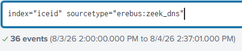

*Pivoted from the C2 connection in [Step 10](Investigation-Steps-Methods-and-Lessons-Learned.md#step-10) to `zeek_dns`.*

### Evidence Examined

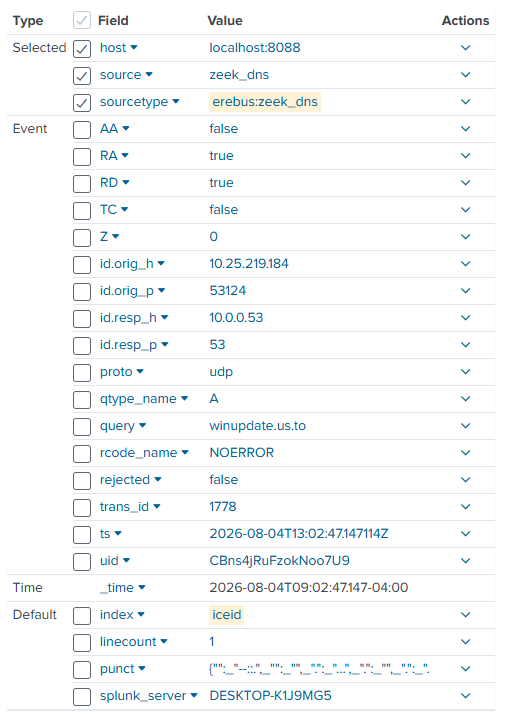

*The supplied log only provides anothe perspective to validated C2 context* 

**Notable Findings:**

- source `10.25.219.184`
- query `winupdate[.]us[.]to`
- timestamp matching the C2 window.

### Analysis

- **Observed Activity:** Zeek DNS corroborated resolution of the known C2 domain from the compromised workstation.
- **Assessment — High confidence:** The record supported the C2 finding but did not show AD reconnaissance.
- **Hypothesis — Posited:** Internal enumeration might be visible in another network-control source.
- **Role of the Evidence:** Added redundant C2 validation while establishing that this source did not answer the current question.
- **Validation — Supported:** The evidence portrays prior posited hypotheses from another angle, acting as redundant validation. 

### Investigative Decision

- **Action — Pivot:** Move to PAN-OS in [Step 12](#step-12), expecting the perimeter source might expose scanning or authentication activity.

### Lesson Learned

Just because DNS is involved in network communication doesn't mean it is the best source for every event including communications. Initially, I tried to spin the finding into helpful redundant evidence. Upon review, I realized this time was a great learning moment but not a necessary factor of the investigation. 

### Context Timeline

| Timestamp | Event          | Key artifact          | ATT&CK mapping | Relationship to current step |
| --------- | -------------- | --------------------- | -------------- | ---------------------------- |
| 09:02:45  | C2 connection  | `51[.]89[.]133[.]3`   | T1071.001 Web Protocols      | Prior finding                |
| 09:02:47  | C2 DNS query   | `winupdate[.]us[.]to` | T1071.001 Web Protocols      | Current evidence             |
| 09:03:47  | DCs enumerated | `nltest`              | T1018 Remote System Discovery          | Evidence found later         |

## Step 12 — Checking PAN-OS for Discovery Activity

### Intent

Primarily, search PAN-OS perimeter firewall logs for clues on AD recon. Secondarily, get familiar with PAN-OS log analysis.

### Search Method

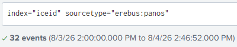

*Reviewed the 32 PAN-OS events to understand them better.*

### Evidence Examined

The event set appeared to contain authentication activity, but source fields indicated potential for redundant validation rather than further findings.

### Analysis

- **Observed Activity:** PAN-OS contained multiple apparent authentication records, but none clearly described the reconnaissance commands being sought.
- **Assessment — Low confidence:** The source could later support lateral-movement authentication if I need it.
- **Hypothesis — Posited:** Endpoint process creation would expose the native recon tool more directly than network-control telemetry.
- **Role of the Evidence:** Established a useful future source and a current dead end.
- **Validation — Required:** Return to PAN-OS when user behavior validation requires authentication logs.

### Investigative Decision

- **Action — Redirect:** Switch from network telemetry to endpoint sources I was more familiar with. This led to Sysmon Process Access in [Step 13](Investigation-Steps-Methods-and-Lessons-Learned.md#step-13).

### Lesson Learned

If a true incident investigation occurred in the future, I would know to very quickly scan an unfamiliar source, phone a friend, and/or do a few quick Google searches before investing significant time into it. In this case, I didn't comb all 32 sources, but I did comb quite a few. As a way to familiarize myself with PAN-OS logs, this was effective; to complete an investigation in a timely manner, this was destructive. 

### Context Timeline

| Timestamp | Event                 | Key artifact          | ATT&CK mapping               | Relationship to current step  |
| --------- | --------------------- | --------------------- | ---------------------------- | ----------------------------- |
| 09:02:47  | C2 DNS query          | `winupdate[.]us[.]to` | T1071.001 Web Protocols                    | Prior pivot                   |
| 09:03:47  | DCs enumerated        | `nltest`              | T1018 Remote System Discovery — Posited at this step | Unknown target evidence       |
| 09:07:45  | Domain authentication | `t.reyes`             | T1078.002 Domain Accounts                    | Source value recognized later |

## Step 22 — Following the Rosa False Lead

### Intent

(1) Seek context regarding network baseline and (2) identify users/hosts related to the CTFs question regarding a network shared credential harvester. 

### Search Method

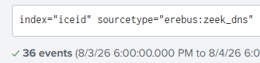

*Started in Zeek DNS after [Step 21](Investigation-Steps-Methods-and-Lessons-Learned.md#step-21), then searched the resulting client IP and name*

### Evidence Examined

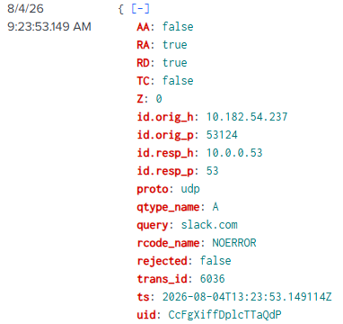

*The Slack record supplied an unfamiliar IP but no direct attacker artifact.*

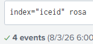

*Searching Rosa.d came up with Rosa.c as well.*

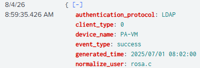

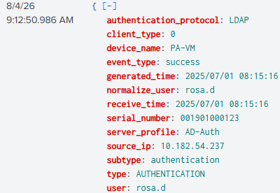

*The records showed `rosa.c` and `rosa.d` were different identities; only `rosa.d` matched the IP.*

**Notable Findings:**

- query `slack[.]com`
- source IP `10.182.54.237`
- identities `rosa.c` and `rosa.d`.

### Analysis

- **Observed Activity:** A host associated with `rosa.d` queried Slack. A separate record referenced `rosa.c` without the same identifying context.
- **Assessment — Low confidence:** The activity appeared benign and did not connect either user to the known attacker chain.
- **Hypothesis — Posited:** Slack or one of the Rosa identities were not particularly suspicious for having accessed the shared credential harvester, but could be involved later. 
- **Role of the Evidence:** Provided environment context but no supported incident relationship.
- **Validation — Required:** A known indicator, malicious process, or timeline correlation would be needed before pursuing either identity.

### Investigative Decision

- **Action — Redirect:** Drop the Rosa lead and return to process creation in [Step 23](#step-23), looking for a file-sharing or credential-harvesting process.

### Lesson Learned

The two Rosas appeared in two potentially valuable areas of the timeline (initial access and between Account Hidden and Exfiltration), but did not prove membership in the incident. This taught me two lessons: 

(1) always validate your primary lead--I did look into both dana's network activity thereafter, and the volume of logs warranted further investigation until I realized it was two people. 
(2) Timeline may warrant suspicion, but just because I want an event to relate to the timeline does mean it does; convenient findings are not always helpful findings. 

### Context Timeline

| Timestamp | Event | Key artifact | ATT&CK mapping | Relationship to current step |
| --- | --- | --- | --- | --- |
| 09:22:03 | Account hidden | `oldadministrator` | T1112 Modify Registry | Last confirmed attacker activity |
| 09:23:53 | Slack DNS query | `10.182.54.237` | N/A | Current weak signal |
| 10:24:05 | rclone launched | `rclone.exe` | T1567.002 Exfiltration to Cloud Storage | Later confirmed activity |

## Step 23 — Testing Outlook as a Fileshare Lead

### Intent

Re-interpret "file share" as "shared file" across an Email network to answer the CTF network-shared credential harvester question. 

### Search Method

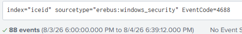

*Reviewed Event 4688 (A new process has been created) chronologically after dropping the Rosa lead.*

### Evidence Examined

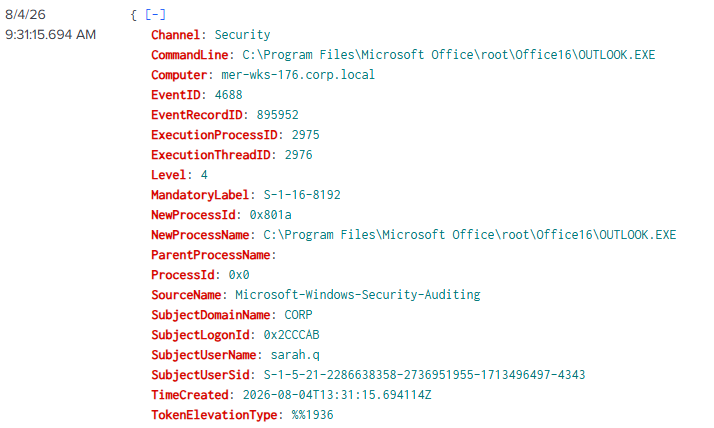

*Chose the next plausible sharing-related process, then evaluated whether it carried any malicious context.*

**Notable Findings:**

- timestamp `09:31:15.694`
- computer `mer-wks-172.corp.local`
- process `OUTLOOK.EXE`.

### Analysis

- **Observed Activity:** Outlook started on a workstation not previously connected to the incident.
- **Assessment — Low confidence:** The event was normal corporate behavior and contained no suspicious parent, command line, user, or indicator linking it to the attacker.
- **Hypothesis — Posited:** Email might have functioned as the “network share” intended by the question.
- **Role of the Evidence:** Tertiary context in-case the investigation went back to email-based evidence (unlikely).
- **Validation — Required:** Context related to the host and email activity.

### Investigative Decision

- **Action — Redirect:** Drop the Outlook interpretation and continue backward from ransomware impact. That decision produced the rclone finding in [Step 24](Investigation-Steps-Methods-and-Lessons-Learned.md#step-24).
- **Alternatives considered:** Enumerate Outlook child processes or review surrounding host activity--rejected due to improbability of helpful findings.

### Lesson Learned

Though this dead-end was useless on its own, the mental process of thinking outside the box was ultimately what led to the investigation's completion. Prior, I was thinking more by-the-book, but at this point in the investigation, I started thinking more creatively, teaching me the importance of "removing your blinders" and recognizing your mental framework limitations. 

### Context Timeline

| Timestamp | Event | Key artifact | ATT&CK mapping | Relationship to current step |
| --- | --- | --- | --- | --- |
| 09:22:03 | Account hidden | `oldadministrator` | T1112 Modify Registry | Last confirmed activity |
| 09:31:15 | Outlook launched | `OUTLOOK.EXE` | N/A | Current dead end |
| 10:24:05 | Cloud copy launched | `rclone.exe` | T1567.002 Exfiltration to Cloud Storage | Next confirmed activity |

## Step 25 — Testing the Slack Lead

### Intent

Determine whether Slack activity explained the network-shared credential harvester.

### Search Method

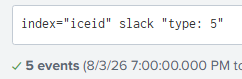

*Searched Slack globally and reviewed the small result set for incident identities and the 09:22–10:24 gap.*

### Evidence Examined

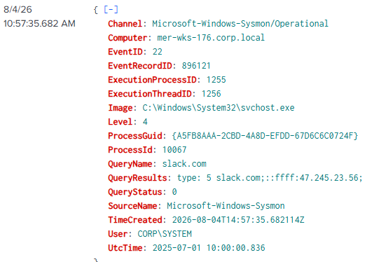

*The most recent result occurred after the known ransomware activity and did not match the incident chain.*

**Notable Findings:**

- user/host identity
- timestamp
- source IP
- relationship to confirmed artifacts.

### Analysis

- **Observed Activity:** Slack appeared in a few records across the environment, including benign activity and activity outside the relevant timeline.
- **Assessment — Low confidence:** The dataset did not support Slack as the credential-harvesting resource or an attacker-controlled fileshare.
- **Hypothesis — Posited:** Slack might have hosted or transmitted the sought resource.
- **Role of the Evidence:** Tested and weakened that hypothesis.
- **Validation — Required:** Detailed records of slack interactions or further chain-of-event evidence. 

### Investigative Decision

- **Action — Redirect:** Return to Sysmon Event 1 (Process creation) to understand what exfiltration and ransomware preparation looked like in this scenario. This produced the VSSAdmin finding in [Step 26](Investigation-Steps-Methods-and-Lessons-Learned.md#step-26).

### Lesson Learned

It's important to tally your resources before you dig into evidence. In this case, I was used to Tryhackme and BTL1 training which included more training within network traffic using Wireshark. As such, I presumed more information would come of a log including slack, even if it wasn't quite as detailed as a PCAP. That presumption was incorrect and wasted time in this instance. 

### Context Timeline

| Timestamp | Event | Key artifact | ATT&CK mapping | Relationship to current step |
| --- | --- | --- | --- | --- |
| 09:23:53 | Slack DNS query | `slack[.]com` | N/A | Origin of hypothesis |
| 10:24:05 | rclone launched | `rclone.exe` | T1567.002 Exfiltration to Cloud Storage | Confirmed activity boundary |
| 10:54:12 | VSS deletion launched | `vssadmin.exe` | T1490 Inhibit System Recovery | Next useful finding |

## Step 27 — Redirecting Through OSINT and `svchost.exe`

### Intent

Use OSINT to identify a new artifact that could provide hints on the network-shared credential harvester

### Search Method

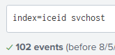

*After [Step 26](Investigation-Steps-Methods-and-Lessons-Learned.md#step-26), searched `svchost` globally and manually reviewed the unresolved timeline; this was only a viable search given the ~500 logs in the entire set.*

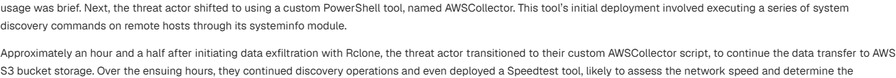

*Compared the result set with the DFIR.*

### Evidence Examined

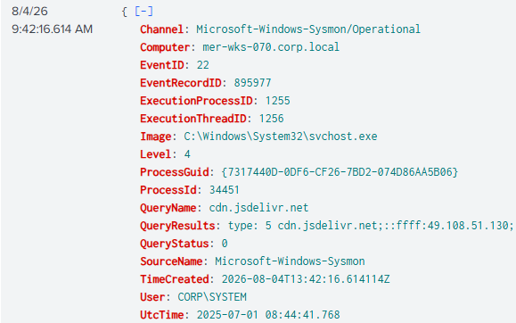

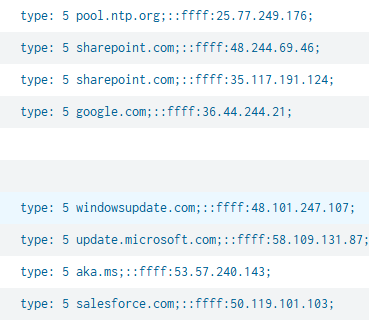

*Campaign research introduced `AWSCollector`; the local searches did not produce a direct, incident-linked match.*

**Notable Findings:**

- process `svchost.exe`
- possible `AWSCollector` string
- DNS query names
- incident-linked users and hosts.

### Analysis

- **Observed Activity:** The source dataset contained `svchost.exe` and multiple service/file-sharing queries, but no captured artifact tied `AWSCollector` to the attacker chain.
- **Assessment — Low confidence:** The search generated general context but no supported finding.
- **Hypothesis — Posited:** Behaviors between the registry edit and exfiltration were likely not going to be found through research or local logs. 
- **Role of the Evidence:** Helped enumerate context for environment's svchost activity, allowing me to drop several potential leads based in OSINT research.
- **Validation — Required:** A deeper search of the events between 9:22 and 10:24.

### Investigative Decision

- **Action — Redirect:** Stop searching direct leads from OSINT and inspect successful proxy file activity directly in [Step 28](#step-28).

### Lesson Learned

OSINT research may not always be relied on for direct artifact investigation. In the DFIR referenced throughout, there were exact references to particular artifacts such as file[.]io that were included in my investigation, but this did not mean the entire incident matched. 

### Context Timeline

| Timestamp | Event | Key artifact | ATT&CK mapping | Relationship to current step |
| --- | --- | --- | --- | --- |
| 09:22:03 | Persistence established | `oldadministrator` | T1136.001 Local Account / T1112 Modify Registry | Search-window start |
| 10:24:05 | rclone launched | AWS S3 backend | T1567.002 Exfiltration to Cloud Storage | Known collection/exfil context |
| 10:54:12 | VSS deletion launched | `vssadmin.exe` | T1490 Inhibit System Recovery | Search-window end |

## Step 28 — Rechecking Successful Proxy Downloads

### Intent

Find a web-delivered file that might explain the network-shared credential harvester.

### Search Method

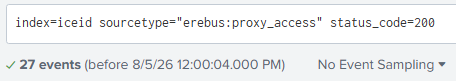

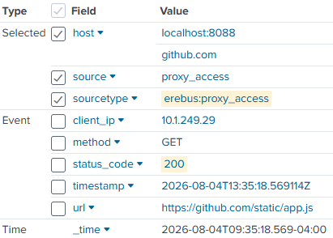

*Filtered proxy activity for successful requests and file-like paths, then compared client IPs with known compromised systems.*

### Evidence Examined

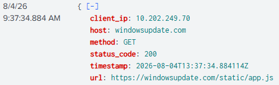

*The results referenced `app.js` from GitHub and a Microsoft-hosted update domain but did not match known incident identities.*

**Notable Findings:**

- HTTP status `200`
- requested file `app.js`
- client IP
- source domain.

### Analysis

- **Observed Activity:** Two successful JavaScript requests for "`app.js`" appeared in the proxy data, but their client IPs were not associated with the established compromise.
- **Assessment — Low confidence:** The requests were insufficient to classify as malicious.
- **Hypothesis — Posited:** A downloaded file might have been used as a credential harvester on another host.
- **Role of the Evidence:** Helped me to understand the details of a GitHub or Microsoft-hosted event, indicating that I would not likely find substantial evidence therein.
- **Validation — Required:** Detailed information and chain-of-event correlation regarding the app.js downloads.

### Investigative Decision

- **Action — Redirect:** Drop the proxy lead and return to the known `passwords.xlsx` artifact in [Step 29](#step-29).

### Lesson Learned

Two instances of app.js cross two sources may have been suspicious, but there was no conclusive evidence thereafter. This taught me that it's possible to have a lot of the same lead without it being explicitly malicious. I kept these leads for reference if needed, but only as tertiary evidence of low-confidence hypotheses.

### Context Timeline

| Timestamp    | Event              | Key artifact     | ATT&CK mapping | Relationship to current step |
| ------------ | ------------------ | ---------------- | -------------- | ---------------------------- |
| 09:05:14     | Password file read | `passwords.xlsx` | T1552.001 Credentials In Files      | Known answer overlooked      |
| ~09:22-10:24 | `app.js` retrieved | `app.js`         | N/A            | Current dead end             |
| 10:24:05     | rclone launched    | AWS S3           | T1567.002 Exfiltration to Cloud Storage      | Known later activity         |

## Step 29 — Returning to the Shared-File Evidence

### Intent

Re-examine `passwords.xlsx` as a possible source for the network-share question.

### Search Method

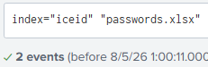

*Searched the known filename and reviewed the related event.*

### Evidence Examined

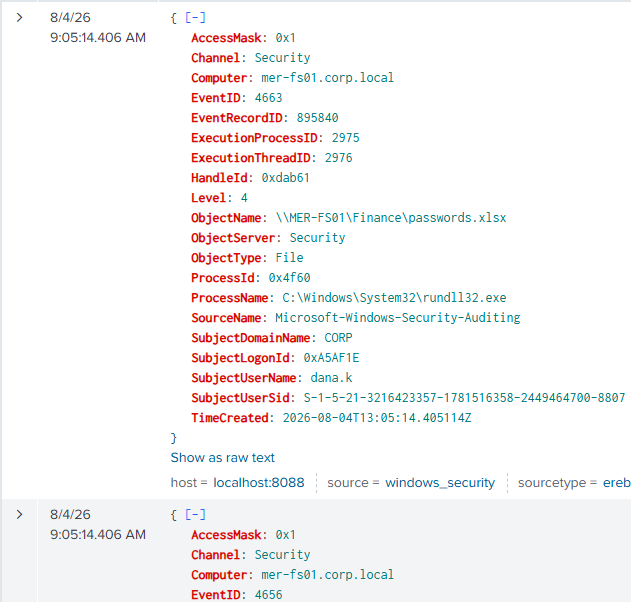

*Chose the Event 4656 (A handle to an object was requested) record because it supplied request context for the same object read in [Step 14](Investigation-Steps-Methods-and-Lessons-Learned.md#step-14).*

**Notable Findings:**

- event `4656` (A handle to an object was requested)
- object `passwords.xlsx`
- subject `dana.k`
- process `rundll32.exe`
- requested access.

### Analysis

- **Observed Activity:** Event 4656 (A handle to an object was requested) showed access request for the credential-themed file. Event 4663 (An attempt was made to access an object) in Step 14 showed that access rights were subsequently granted.
- **Assessment — High confidence:** Together, the records supported malicious access to a protected network-share file. 
- **Hypothesis — Supported:** `passwords.xlsx` was shown as a plausible credential source used before lateral movement.
- **Role of the Evidence:** Added request context to the stronger Event 4663 (An attempt was made to access an object) finding.
- **Validation — Optional:** File contents and subsequent credential-use evidence would validate contents of `passwords.xlsx`.

### Investigative Decision

- **Action — Redirect:** Continue validating exfiltration and recovery findings rather than accepting the file as the answer. This continuation led to [Step 30](#step-30).

### Lesson Learned

Sometimes thinking too hard doesn't help you. Being extra cautious aided in such findings as the scheduled task persistence event, where "MicrosoftUpdateSync" was attacker-placed persistence. In this case, I had assumed a deeper scenario regarding the credential harvest event and landed on an unnecessary analysis of the event--while never realizing the event in question was the event I was looking for. 

### Context Timeline

| Timestamp | Event | Key artifact | ATT&CK mapping | Relationship to current step |
| --- | --- | --- | --- | --- |
| 09:05:14 | Handle requested | Event 4656 (A handle to an object was requested) | T1552.001 Credentials In Files — Posited | Supporting evidence |
| 09:05:14 | File read | Event 4663 (An attempt was made to access an object), `0x1` | T1552.001 Credentials In Files | Stronger related evidence |
| 09:07:45 | Domain logon | `t.reyes` | T1078.002 Domain Accounts | Later support |

## Step 30 — Researching the rclone Command

### Intent

Validate what each rclone argument meant and determine whether the endpoint record proved completion, finding downstream context for credential harvesting events. 

### Search Method

Returned to the Event 4688 (A new process has been created) command from [Step 24](Investigation-Steps-Methods-and-Lessons-Learned.md#step-24) and checked the [official rclone documentation](https://rclone.org/).

### Evidence Examined

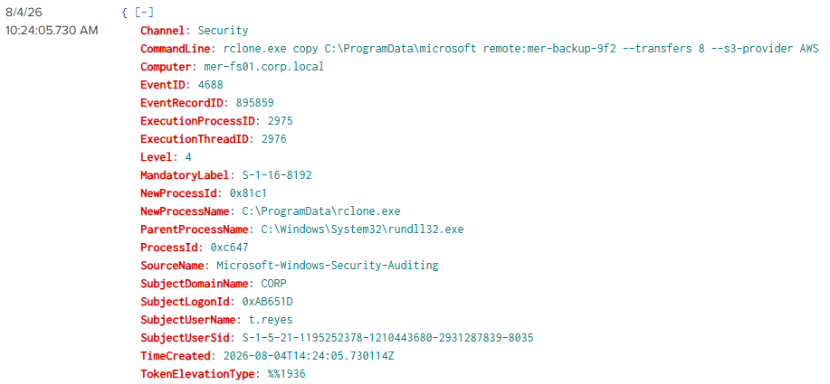

*Re-examined the exact command line rather than searching its EventRecordID in unrelated sources.*

**Notable Findings:**

- `copy`
- `C:\ProgramData\microsoft`
- `remote:mer-backup-9f2`
- `--transfers 8`
- `--s3-provider AWS`.

### Analysis

- **Observed Activity:** The command configured a recursive copy from the local directory to an rclone path using the AWS S3 provider and up to eight concurrent transfers (default rate).
- **Assessment — High confidence:** The process and exfiltration-oriented arguments executed. Transfer completion and data volume remained unverified.
- **Hypothesis — Supported:** The attacker used rclone for S3-directed exfiltration before encryption.
- **Role of the Evidence:** Allowed greater understanding of the rclone event, where prior investigative notes contained misconceptions. 
- **Validation — Required:** rclone output/logs.

### Investigative Decision

- **Action — Research:** Return to the VSSAdmin and Event 1102 (The audit log was cleared) sequence in [Step 31](Investigation-Steps-Methods-and-Lessons-Learned.md#step-31), applying the same distinction between process launch and outcome.

### Lesson Learned

Reviewing prior evidence is not necessarily a weak-point in an investigation. My prior assumptions on the rclone event were enough to support the exfiltration claims, but the majority of the command line was still unknown to me. After reviewing this, I was better able to create the documentation found in my Incident Report and Investigation Steps documents. This additional context may waste time during an active incident investigation, but for the purposes of this project, it proved useful. 

### Context Timeline

| Timestamp | Event | Key artifact | ATT&CK mapping | Relationship to current step |
| --- | --- | --- | --- | --- |
| 10:24:05 | rclone launched | `remote:mer-backup-9f2` | T1567.002 Exfiltration to Cloud Storage | Current evidence |
| 10:54:12 | VSS deletion launched | `vssadmin.exe` | T1490 Inhibit System Recovery | Next validation target |
| 10:55:44 | Encryption begins | `.dagoned` | T1486 Data Encrypted for Impact | Later impact |

## Step 32 — Reinterpreting the Network-Share Question

### Intent

Reconsider the wording after ten pivots failed to reveal a credential harvester shared by the attacker on the network.

### Search Method

Read the question and reframed the emphases in the prose in the CTF question. 

### Evidence Examined

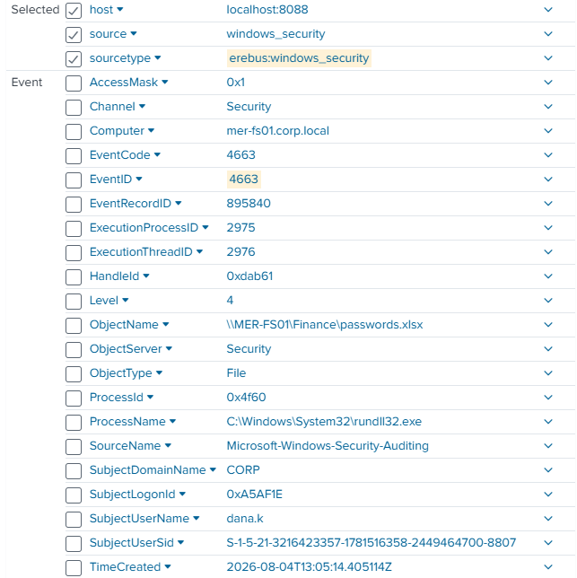

*The Event 4663 (An attempt was made to access an object) record from Step 14 and 29 was the answer: the attacker opened an existing file on a network share.*

**Notable Findings:**

- object `\\MER-FS01\Finance\passwords.xlsx`
- process `rundll32.exe`
- access mask `0x1`
- user `dana.k`.

### Analysis

- **Observed Activity:** The compromised process read `passwords.xlsx` from the finance share.
- **Assessment — High confidence:** The file satisfied the CTF question and fit the credential-access/lateral-movement timeline.
- **Hypothesis — Supported:** `passwords.xlsx` was the credential-harvesting resource referenced by the CTF.
- **Role of the Evidence:** Move forward in the timeline completion and CTF. 
- **Validation — Optional:** File contents would identify the exposed credentials; the scenario ground truth confirmed the intended answer.

### Investigative Decision

- **Action — Pivot:** Perform a final coverage check in [Step 33](#step-33), then answer the remaining ransomware payload CTF questions.

### Lesson Learned

As an investigator, I'm suspicious of evidence and require validation before making strong claims. As such, I assumed a stance of suspicion against evidence, not necessarily the language of the CTF. While I don't intend to be suspicious of everything all the time, I do think it's worth opening my mind up to further interpretations of anything communication-based. The misconception of CTF wording allowed me numerous great lessons in research and tested my process end-to-end, but in an incident investigation, this would have been a massive misallocation of time. 

Note: in a true incident investigation, I would have phoned a peer after a sufficient amount of time pivoting. For educational purposes, I chose to continue until I could think of no more possible solutions. 

### Context Timeline

| Timestamp | Event              | Key artifact     | ATT&CK mapping | Relationship to current step |
| --------- | ------------------ | ---------------- | -------------- | ---------------------------- |
| 09:05:14  | Password file read | `passwords.xlsx` | T1552.001 Credentials In Files      | Reinterpreted evidence       |
| 09:07:45  | Domain logon       | `t.reyes`        | T1078.002 Domain Accounts      | Later support                |
| 09:07:58  | WMI execution      | `MER-DC01`       | T1047 Windows Management Instrumentation          | Downstream activity          |

## Step 33 — Performing the Final Coverage Check

### Intent

Confirm that the available timeline was complete enough to answer the CTF and support reporting.

### Search Method

Reviewed global `update.dll` activity and the remaining unanswered questions, focusing on the 09:22–10:24 gap.

### Evidence Examined

My contemporaneous narrative records that additional accounts appeared in the global search, but no screenshots or exact records were preserved in the supplied source files.

**Notable Findings:**

- user, computer, `update.dll` command line, and timestamp.

### Analysis

- **Observed Activity:** My notes state additional account activity appeared, stating it as potential lateral compromise. 
- **Assessment — Low confidence:** The resources available held no further validation of further compromised accounts.
- **Hypothesis — Posited:** The attacker may have extended the DLL execution chain to more accounts or hosts before exfiltration.
- **Role of the Evidence:** Help provide context for the 09:22-10:24 gap in substantial log findings.
- **Validation — Required:** Additional logging between the 09:22-10:24 window or account activity regarding compromised hosts during that timeframe.

### Investigative Decision

- **Action — redirect:** Exclude the unpreserved account claims from the incident reconstruction and proceed to the final payload identification in [Step 34](Investigation-Steps-Methods-and-Lessons-Learned.md#step-34).

### Lesson Learned

(1) Insubstantial evidence should not be overstated as validated findings. In my investigator's journal, I made remarks insinuating the malicious DLL export's presence in previously unknown accounts in the network to prove lateral movement for exfiltrated sensitive information. The events may have made a great hypothetical scenario for a theoretical study, but upon review, I realized the evidence failed to prove any of my claims. 
(2) Even for insubstantial claims, it helps to gather evidence. I failed to screenshot the evidence, and as of the writing of the final report, my memory of the evidence is not as clear. As such, I am less able to provide substantial reasoning surrounding the events and I am unable to present it in the instance of an additional resource request for further investigation. 

### Context Timeline

| Timestamp   | Event                                                                | Key artifact                                         | ATT&CK mapping | Relationship to current step |
| ----------- | -------------------------------------------------------------------- | ---------------------------------------------------- | -------------- | ---------------------------- |
| 09:22:03    | Account hidden                                                       | `oldadministrator`                                   | T1112 Modify Registry          | Last documented persistence  |
| 09:22–10:24 | Low-Confidence Events Indicating Lateral Compromise and Exfiltration | Witnessed Malicious DLL Export (unpreserved records) | N/A            | Current limitation           |
| 10:24:05    | rclone launched                                                      | AWS S3                                               | T1567.002 Exfiltration to Cloud Storage      | Next documented action       |

## Appendix Summary

Best-practices differ depending on context. 

During an incident investigation, many of the pivots and dead-ends within this Appendix would cost valuable time and lower the quality of the investigation. 

For a forensic investigation, I may have fared better had I simply requested the resources required for forensic evidence upfront. 

But this investigation was primarily for education. As such, I was able to practice elements of incident investigation and forensic-based investigation while taking additional time to truly learn from the experience. 

I learned valuable lessons in 

- mental frameworks ,
- command line analysis,
- and where my assumptions aid or harm my process. 

Additionally, the process of reviewing these less-fruitful endeavors has allowed me a chance to work on

- documentation,
- verbiage and presentation,
- evidence-based claims,
- and reflections on optimizing my process as an investigator. 

It is my hope that this Appendix serves to provide transparency in my process, both as a learner and practitioner. 

For the primary investigative steps, see [Investigation Steps, Methods, and Lessons Learned.](Investigation-Steps-Methods-and-Lessons-Learned.md).
For the cleaner report, see [Incident Report](Incident-Report.md).
