# Investigation Steps, Methods, and Lessons Learned

## Purpose

This document details the investigation as I performed it. 

While the original investigation was a CTF titled "SOC Analyst CTF — 'Scanned Document 468'", I approached the log set as a true investigation led by evidence, only referencing the CTF questions as checkpoints occasionally. This allowed a fuller learning experience including wrong turns, backward pivots, and moments where I had to step back to research a field, tool, or context before moving forward. 

## Process

My analytical process separates 

- Observed Activity
- Assessment (and confidence; low/med/high)
- Hypothesis (posited/supported)
- Role of Evidence
- Validation (required, optional, or N/A) 
  
As such, each individual finding acts as a sample my continually improving process, not polished landmarks showcasing the perfect investigator. 

My documentation process separates

- Intent
- Search Method
- Evidence Examined
- Analysis 
- Investigative Decision
- Lesson Learned (where valuable)

As such, the goal is for visibility of my end-to-end process between steps at the lowest amount of verbosity while maintaining transparency. 

Additionally, a timeline for context of the step is included at the end of each step. 

For a cleaner, less personal chronology, see my [Incident Report](Incident-Report.md).
For additional investigative steps, see the [Appendix](Appendix-Investigative-Pivots.md)

## Scope, Assumptions, and Reading Considerations

- The CTF supplied a limited dataset where missing telemetry is treated as a limitation, not evidence that an event did not occur.
- **Observed Activity** is restricted to the supplied evidence. 
- **Assessment** states my interpretation and confidence. 
- **Hypothesis** records the explanation I was using to guide the investigation.
- OSINT was used to better inform hypotheses, not replace evidence.
- Process-creation events establish execution, not necessarily successful completion.
- Eleven investigative steps were moved to the [appendix](Appendix-Investigative-Pivots.md) due to their addition of reading friction
- The timestamps are normalized due to an incongruency in Splunk timestamps

### Assessment Confidence

| Rating     | Meaning in this project                                                                            |
| ---------- | -------------------------------------------------------------------------------------------------- |
| **Low**    | Plausible, but supported mainly by context or an incomplete signal                                 |
| **Medium** | Supported by a meaningful artifact, but an important alternative or validation gap remains         |
| **High**   | Supported by direct evidence or multiple correlated sources sufficient for an operational decision |

## Investigative Chronology

This chart follows my work, not the attacker's timeline. Appendix-bound steps remain in their original positions.

```mermaid
flowchart TD
    S1[1 Email Identification] --> S2[2 Execution search]
    S2 --> S3[3 Initial-access validation]
    S3 --> S4[4 C2 and LotL pivot]
    S4 --> S5[5 DNS corroboration]
    S5 --> S6[6 C2 research]
    S6 --> S7[7 Payload validation]
    S7 --> S8[8 Scheduled-task persistence]
    S8 --> S9[9 File-create validation]
    S9 --> S10[10 Cobalt Strike context]
    S10 --> S11[11 Zeek DNS - Appendix]
    S11 --> S12[12 PAN-OS - Appendix]
    S12 --> S13[13 LSASS process access]
    S13 --> S14[14 passwords.xlsx access]
    S14 --> S15[15 AD recon commands]
    S15 --> S16[16 WMI lateral movement]
    S16 --> S17[17 Destination validation]
    S17 --> S18[18 Authentication validation]
    S18 --> S19[19 Hidden-account registry]
    S19 --> S20[20 AnyDesk execution]
    S20 --> S21[21 Account creation]
    S21 --> S22[22 Rosa lead - Appendix]
    S22 --> S23[23 Outlook lead - Appendix]
    S23 --> S24[24 rclone discovery]
    S24 --> S25[25 Slack lead - Appendix]
    S25 --> S26[26 VSSAdmin discovery]
    S26 --> S27[27 OSINT redirection - Appendix]
    S27 --> S28[28 Proxy recheck - Appendix]
    S28 --> S29[29 Shared-file recheck - Appendix]
    S29 --> S30[30 rclone research - Appendix]
    S30 --> S31[31 VSS and log clearing]
    S31 --> S32[32 Question reinterpretation - Appendix]
    S32 --> S33[33 Coverage check - Appendix]
    S33 --> S34[34 Ransomware payload]
```

### Main Step Index

| Steps | Findings                                                                                                                                                                            |
| ----- | ----------------------------------------------------------------------------------------------------------------------------------------------------------------------------------- |
| 1–5   | [Phishing Identification](#step-1) · [Execution search](#step-2) · [Initial-access context](#step-3) · [C2/LotL pivot](#step-4) · [DNS corroboration](#step-5)                      |
| 6–10  | [C2 research](#step-6) · [Payload validation](#step-7) · [Scheduled task](#step-8) · [File-create validation](#step-9) · [Cobalt Strike context](#step-10)                          |
| 13–18 | [LSASS access](#step-13) · [`passwords.xlsx`](#step-14) · [AD reconnaissance](#step-15) · [WMI movement](#step-16) · [Destination execution](#step-17) · [Authentication](#step-18) |
| 19–21 | [Registry concealment](#step-19) · [AnyDesk](#step-20) · [Account creation](#step-21)                                                                                               |
| 24–34 | [rclone](#step-24) · [VSSAdmin discovery](#step-26) · [VSS/log-clearing validation](#step-31) · [Ransomware payload](#step-34)                                                      |

Appendix branches: [Steps 11–12](Appendix-Investigative-Pivots.md#step-11), [Steps 22–23](Appendix-Investigative-Pivots.md#step-22), [Step 25](Appendix-Investigative-Pivots.md#step-25), [Steps 27–30](Appendix-Investigative-Pivots.md#step-27), and [Steps 32–33](Appendix-Investigative-Pivots.md#step-32).

## Main Investigation

## Step 1 — Identifying the Phishing Email

### Intent

Identify the start of the timeline, which likely arose from phishing surrounding scanned document 468 (based on CTF title)

### Search Method

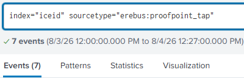

*Started broadly in Proofpoint TAP to identify an activity baseline, then filtered for the vendor's malware classification.*

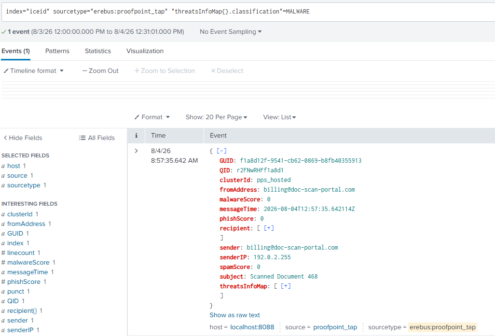

*One event was identified as malware, giving me a single lead to begin the investigation*

### Evidence Examined

*This event identifies the malicious message, recipient, sender, and URL in one record.*

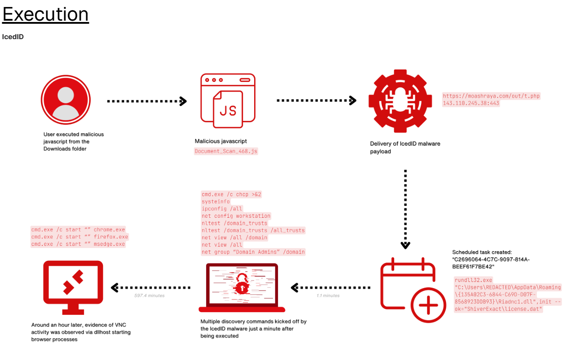

*Searching for similar attacks led to potential leads for later pivots*

**Notable Findings:**

- timestamp `08:57:35.642`
- recipient `dana.k@corp[.]meridian-grp[.]com`
- sender `billing@doc-scan-portal[.]com`
- URL `hxxps://moashraya[.]com/scan/468`
- classification `MALWARE`.

### Analysis

- **Observed Activity:** Proofpoint recorded a message titled `Scanned Document 468` delivered to `dana.k` with a URL classified as malware.
- **Assessment — High confidence:** The email and URL were a credible initial-access lead. The event proved delivery, not user interaction or code execution.
- **Hypothesis — Posited:** The recipient followed the link and initiated the CTF's malicious execution chain.
- **Role of the Evidence:** Established the earliest known artifact and supplied the recipient, URL, and timestamp for pivots.
- **Validation — Required:** Find proxy retrieval or endpoint execution associated with the URL and recipient.

### Investigative Decision

- **Action — Pivot:** Search for the delivered filename and web activity involving `moashraya[.]com` to distinguish delivery from interaction in both virustotal and Splunk. I also used [The DFIR Report's IcedID-to-Dagon case](https://thedfirreport.com/2024/04/29/from-icedid-to-dagon-locker-ransomware-in-29-days/) as a source of possible attacker behavior, sourcing artifacts and context from its similarities throughout my investigation.
- **Alternatives considered:** Return to broader email identification if the URL or filename produced no endpoint or proxy evidence.

### Context Timeline

| Timestamp | Event              | Key artifact               | ATT&CK mapping                     | Relationship to current step |
| --------- | ------------------ | -------------------------- | ---------------------------------- | ---------------------------- |
| 08:57:35  | Phishing delivered | `moashraya[.]com/scan/468` | T1566.002 Spearphishing Link       | Current evidence             |
| ??:??:??  | Script retrieved   | `Document_Scan_468.js`?    | T1204.002 User Execution — Posited | Required validation          |

## Step 2 — Searching for Execution Evidence

### Intent

Search for evidence that `Document_Scan_468.js`  was interacted with.

### Search Method

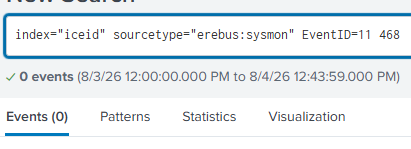

*Started with the known filename, then redirected to web-proxy logs. 

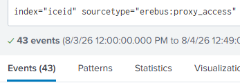

*Reviewed the small proxy result set for `moashraya` and successful HTTP (200) responses.*

### Evidence Examined

*This log indicated a successful GET request that matched the timeline so far.*

**Notable Findings:**

- timestamp `08:59:06.538`
- method `GET`
- status `200`
- URL ending `Document_Scan_468.js`
- client IP `10.25.219.184`.

### Analysis

- **Observed Activity:** The proxy returned HTTP 200 for a `GET` request to the malicious JavaScript URL from `10.25.219.184`.
- **Assessment — High confidence:** The client retrieved the JavaScript resource--the proxy event did not independently prove the script executed or that every response byte was written to disk.
- **Hypothesis — Supported:** dana.k opened `Document_Scan_468.js`, where her endpoint, `10.25.219.184`, was affected.
- **Role of the Evidence:** Validated the execution of malicious javascript, `Document_Scan_468.js`, helped enumerate client IP for dana.k, the suspected first compromised user. 
- **Validation — Required:** Confirm the IP's host and user, then find process creation involving the script or a child process.

### Investigative Decision

- **Action — Pivot:** Search Sysmon for `10.25.219.184`, then examine process and network events near 08:59–09:03. 
- **Alternatives considered:** Search Sysmon Event 11 (File create) for file creation. I deferred it because the immediate need was to connect the proxy client to process activity, and the limited dataset might not contain the expected file event.

### Lesson Learned

While my exact-filename search didn't help the investigation, its value lies in its potential. If a search is quick holds potential, it's alright to do it first--the first step of this investigation was very low-hanging fruit and proved itself to be the best decision of the investigation. 

### Context Timeline

| Timestamp | Event                  | Key artifact    | ATT&CK mapping      | Relationship to current step |
| --------- | ---------------------- | --------------- | ------------------- | ---------------------------- |
| 08:57:35  | Phishing delivered     | `dana.k`        | T1566.002 Spearphishing Link           | Prior lead                   |
| 08:59:06  | Script retrieved       | `10.25.219.184` | T1204.002 Malicious File — Posited | Current evidence             |
| ??:??:??  | Command shell spawned? | ???             | ???                 | Later validation             |

## Step 3 — Validating Initial Access Through Context

### Intent

Link `10.25.219.184` to a host, user, and suspicious process chain.

### Search Method

Searched Sysmon for `10.25.219.184` and reviewed nearby network and process records.

### Evidence Examined

*Chose this record because it showed the client IP to `dana.k`, `mer-wks-114`, `rundll32.exe` (potential LotL), and a potential C2 destination.*

**Notable Findings:**

- source IP `10.25.219.184`
- computer `mer-wks-114.corp.local`
- user `CORP\dana.k`
- image `rundll32.exe`
- destination `winupdate[.]us[.]to` / `51[.]89[.]133[.]3`.

### Analysis

- **Observed Activity:** Sysmon Event 3 (Network connection) showed the `10.25.219.184` ip, CORP\dana.k, and mer-wks-114.corp.local together, where `rundll32.exe` connected to an external destination.
- **Assessment — High confidence:** The host/user identity from the proxy lead were now established, and the process-associated external connection warranted high suspicion.
- **Hypothesis — Supported:** `dana.k` on `mer-wks-114` with ip 10.25.219.184 was the initial foothold created via the phishing sequence.
- **Role of the Evidence:** Joined email, proxy, endpoint identity, and external network activity into one investigative thread.
- **Validation — Required:** Find the process chain before the connection and corroborate the destination through DNS or independent network telemetry.

### Investigative Decision

- **Action — Pivot:** Follow `dana.k`, `rundll32.exe`, and the 09:02 timeframe in Sysmon rather than treating the C2 destination as a sole  indicator.

### Context Timeline

| Timestamp | Event               | Key artifact    | ATT&CK mapping      | Relationship to current step |
| --------- | ------------------- | --------------- | ------------------- | ---------------------------- |
| 08:59:06  | Script retrieved    | `10.25.219.184` | T1204.002 Malicious File — Posited | Source lead                  |
| ??:??:??  | DLL Compromise?     | ???             | T1105 Ingress Tool Transfer               | Preceding behavior           |
| 09:02:45  | External connection | `rundll32.exe`  | T1071.001 Web Protocols — Posited | Current evidence             |

## Step 4 — Following the C2 and Living-off-the-Land Chain

### Intent

Provide context for the prior finding; what is DLL doing, why is it doing it, and how? 
### Search Method

Used [Step 3's](#step-3) Sysmon Event 3 (Network connection) record to recognize a potential gap in the timeline, prioritizing process creation and file-transfer commands.

### Evidence Examined

The primary record was the Sysmon Event 3 (Network connection) shown in [Step 3](#step-3), followed by nearby Sysmon Event 1 (Process creation) records involving `rundll32.exe` and PowerShell.

**Notable Findings:**

- image `rundll32.exe`
- destination port `443`
- destination `winupdate[.]us[.]to`
- source user `dana.k`.

### Analysis

- **Observed Activity:** A native Windows loader (`rundll32.exe`) initiated an outbound TLS connection to malicious host associated with [IcedID-to-Dagon chain](https://thedfirreport.com/2024/04/29/from-icedid-to-dagon-locker-ransomware-in-29-days/).
- **Assessment — High confidence:** This behavior was command-and-control activity within the developing compromise. 
- **Hypothesis — Posited:** A prior stage used a LotL process chain to retrieve and run a second-stage beacon from `winupdate[.]us[.]to` through `rundll32.exe`.
- **Role of the Evidence:** Defined the C2 pivot and filled gaps in step 3's timeline window for locating the payload download.
- **Validation — Required:** Corroborate name resolution and identify the process that created or controlled the suspicious `rundll32.exe` instance.

### Investigative Decision

- **Action — Pivot:** Search all Sysmon events for `dana.k` around the connection time, beginning with DNS and process creation. I chose host-side correlation over an immediate reputation lookup because it could explain how the process reached the C2 destination.
- **Alternatives considered:** Search the domain and IP globally or perform reputation analysis first.

### Context Timeline

| Timestamp | Event            | Key artifact            | ATT&CK mapping      | Relationship to current step |
| --------- | ---------------- | ----------------------- | ------------------- | ---------------------------- |
| 08:59:06  | Script retrieved | `10.25.219.184`         | T1204.002 Malicious File — Posited | Prior evidence               |
| 09:02:45  | C2 connection    | `51[.]89[.]133[.]3:443` | T1071.001 Web Protocols — Posited | Current evidence             |
| ???       | ???              | `winupdate[.]us[.]to`   | T1071.001 Web Protocols — Posited | Next validation              |

## Step 5 — Corroborating C2 Through DNS

### Intent

Confirm that the network event and suspicious process resolved the same destination (validate C2 event and host).

### Search Method

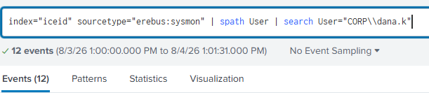

*Searched `dana.k` in Sysmon and reviewed Event IDs 1 (Process creation), 3 (Network connection), and 22 (DNS query) around the C2 window.*

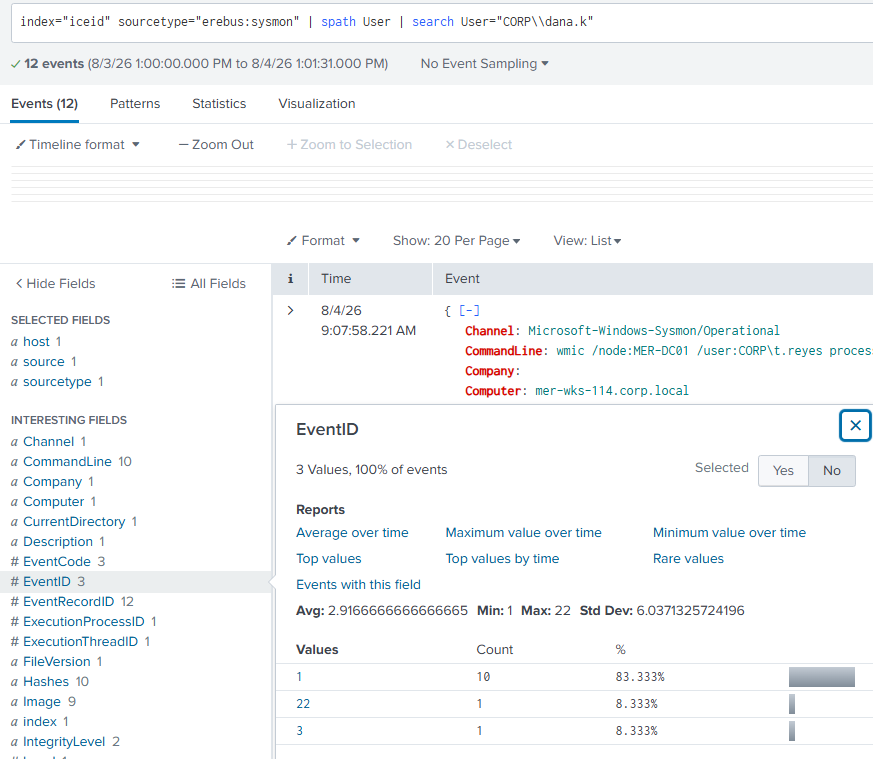

*The small result set allowed manual review without adding more filters.*

### Evidence Examined

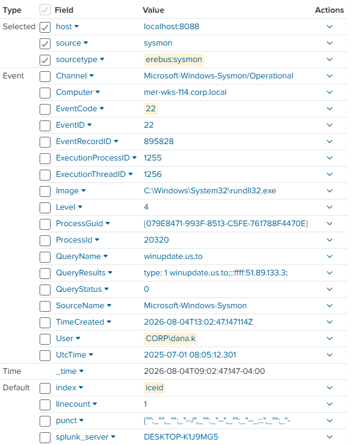

*This log indicates the same user, host, process, and destination within seconds of the network connection-- but I wasn't used to Sysmon 22 (DNS query), so I investigated it*

**Notable Findings:**

- timestamp `09:02:47.147`
- query `winupdate[.]us[.]to`
- image `rundll32.exe`
- user `CORP\dana.k`.

### Analysis

- **Observed Activity:** Sysmon Event 22 (DNS query) recorded `rundll32.exe` resolving `winupdate[.]us[.]to` two seconds after the Sysmon Event 3 (Network connection) connection timestamp.
- **Assessment — High confidence:** DNS and network logs described the same suspicious process/destination sequence. DNS resolution supported the destination `winupdate[.]us[.]to` but did not independently prove mobility of a payload or beacon communication, just connection and querying.
- **Hypothesis — Supported:** The compromised `rundll32.exe` process was communicating with C2 infrastructure, could support further remote-access/control or payload evidence if found later.
- **Role of the Evidence:** Corroborated the destination across two Sysmon event types, allowing me to think of how I could further validate the potential compromise of `rundll32.exe`
- **Validation — Optional:** Zeek connection telemetry or payload analysis could strengthen the beacon assessment.

### Investigative Decision

- **Action — Research:** Investigate `winupdate[.]us[.]to` using [OSINT](https://www.mphasis.com/content/dam/mphasis-com/global/en/home/services/cybersecurity/icedid-infection-to-dagon-locker-ransomware-apr29-22-7.pdf), then use the research to perform a better informed search of the host. 

### Lesson Learned

I'd initially Googled Sysmon 22 (DNS query) and decided this proved connections, and I wrote in my investigative journal that a payload succeeded because of this--then I looked at the keyword, "logs DNS *queries*". This simply meant a process queried DNS, warranting further analysis of the success of this query and further actions. 

### Context Timeline

| Timestamp | Event               | Key artifact          | ATT&CK mapping      | Relationship to current step |
| --------- | ------------------- | --------------------- | ------------------- | ---------------------------- |
| ??:??:??  | Payload retrieved   | DLL injector?         | T1105 Ingress Tool Transfer               | Earlier event?               |
| 09:02:45  | External connection | `51[.]89[.]133[.]3`   | T1071.001 Web Protocols — Posited | Correlated evidence          |
| 09:02:47  | DNS resolution      | `winupdate[.]us[.]to` | T1071.001 Web Protocols — Posited | Current evidence             |

## Step 6 — Researching the C2 and Second-Stage Payload

### Intent

Continue exploring the role of `winupdate[.]us[.]to`, focused on retroactive analysis in the timeline to validate `rundll32.exe` compromise.

### Search Method

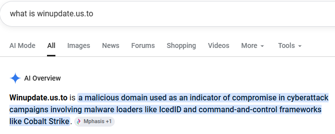

*Researched the domain, checked the cited source, and then returned to Sysmon Event 1 (Process creation) near the beacon time.*

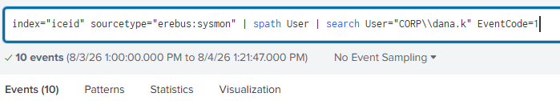

*Used the [DFIR](https://thedfirreport.com/2024/04/29/from-icedid-to-dagon-locker-ransomware-in-29-days/) to generate artifacts to test

### Evidence Examined

*This event precedes the C2 connection by 25 seconds and recorded the second-stage file path/source service, helping me to validate `rundll32.exe` compromise* 

**Notable Findings:**

- timestamp `09:02:20.230`
- command `DownloadFile(...)`
- source `file[.]io`
- destination `C:\ProgramData\update.dll`
- parent `rundll32.exe` launched from `magni.waut.a` context.

### Analysis

- **Observed Activity:** PowerShell used `System.Net.WebClient.DownloadFile` to request a file from `file[.]io` and save it as `C:\ProgramData\update.dll`. The process ran directly before the [suspicious `rundll32.exe` chain](#step-4).
- **Assessment — High confidence:** This was an ingress tool-transfer event in the same chain as the later [C2 activity](#step-4). 
- **Hypothesis — Supported:** The first stage retrieved `update.dll`, which was then loaded through `rundll32.exe` and used for the observed second-stage C2 activity. Further evidence via research into the role of magni.waut.a as the initial payload from moashraya found in the [DFIR](https://thedfirreport.com/2024/04/29/from-icedid-to-dagon-locker-ransomware-in-29-days/) allows for a more complete staging-sequence to unfold, supporting the role of the [OSINT](https://thedfirreport.com/2024/04/29/from-icedid-to-dagon-locker-ransomware-in-29-days/)  in aiding the investigation.  
- **Role of the Evidence:** Supplied the second-stage source, destination path, posited process ancestry, and timing needed to connect execution to the beacon.
- **Validation — Required:** Locate the earlier script-driven command that created `magni.waut.a` and later execution involving `update.dll`.

### Investigative Decision

- **Action — Pivot:** Move backward from 09:02:20 in Sysmon Event 1 (Process creation) to identify the first child process of `Document_Scan_468.js` and the command that staged `magni.waut.a`.
- **Alternatives considered:** During the investigation, I interpreted the hash of the evidence log as the hash of the parent command line or command line, so I did a VirusTotal of the hash. This led to the 2nd lesson learned below.

### Lesson Learned

(1) While OSINT should be used to inform context and behavior of similar scenarios, it sometimes produces direct results. In this case, the dissection of moashraya and magni.waut.a in the [DFIR](https://thedfirreport.com/2024/04/29/from-icedid-to-dagon-locker-ransomware-in-29-days/) allowed swift analysis via local evidence. 
(2) Just because a log contains a hash or image does not mean this is the most important artifact; many reports justify themselves, ultimately, via hashes, and justly so given their proof of integrity. This led me to believe that where a hash is present, it should be treated as an important artifact--in this case, the hash simply described powershell. 
### Context Timeline

| Timestamp | Event | Key artifact | ATT&CK mapping | Relationship to current step |
| --- | --- | --- | --- | --- |
| 08:59:52 | First stage retrieved | `magni.waut.a` | T1105 Ingress Tool Transfer | Earlier validation target |
| 09:02:20 | Second stage retrieved | `update.dll` | T1105 Ingress Tool Transfer | Current evidence |
| 09:02:45 | C2 connection | `winupdate[.]us[.]to` | T1071.001 Web Protocols | Supported outcome |

## Step 7 — Validating the Payload Chain

### Intent

Find the first child process and command produced by the phishing-delivered `Document_Scan_468.js`.

### Search Method

Scrolled backward from the 09:02:20 Sysmon Event 1 (Process creation) and reviewed process ancestry involving `wscript.exe`, `cmd.exe`, and the known delivery domain `moashraya[.]com`.

### Evidence Examined

*This event contained a child process that fit the timeline, so I chose it out of suspicion that it contained the first child process in the chain* 

**Notable Findings:**

- timestamp `08:59:52.239`
- parent `wscript.exe`
- child `cmd.exe`
- command using `curl`
- output `%TEMP%\magni.waut.a`.

### Analysis

- **Observed Activity:** `wscript.exe` spawned `cmd.exe`, which ran `curl` against `moashraya[.]com` and wrote `magni.waut.a` to the user's temporary directory.
- **Assessment — High confidence:** The phishing-delivered `Document_Scan_468.js` executed and started the first-stage download chain. 
- **Hypothesis — Supported:** `Document_Scan_468.js` initiated the execution chain that staged `magni.waut.a`, retrieved `update.dll`, and reached the C2 destination.
- **Role of the Evidence:** Closed the main validation gaps left by the [email](#step-1) and [proxy](#step-3) events, also validated my suspicions surrounding the role of magni.waut.a similar to the [DFIR](https://thedfirreport.com/2024/04/29/from-icedid-to-dagon-locker-ransomware-in-29-days/) 
- **Validation — N/A:** The process ancestry and command line were sufficient for the next investigative decision; payload-content analysis remained outside the scope.

### Investigative Decision

- **Action — Pivot:** Move forward from first-stage execution to persistence artifacts, using the CTF question about a scheduled task to choose the most relevant Windows event source.

### Lesson Learned

In prior investigations, retrospective analysis typically warranted more questions than answers, but this investigation presented a case where closing these gaps retrospectively provided the strongest grounds for further investigation. Moving forward, I'll treat the direction of investigation (forward vs backward in the timeline) as a variable dependent on context rather than default to forward movement. 

### Context Timeline

| Timestamp | Event                  | Key artifact              | ATT&CK mapping | Relationship to current step  |
| --------- | ---------------------- | ------------------------- | -------------- | ----------------------------- |
| 08:59:06  | Script retrieved       | `Document_Scan_468.js`    | T1204.002 Malicious File      | Preceding event               |
| 08:59:52  | Command shell spawned  | `wscript.exe` → `cmd.exe` | T1059.007 JavaScript/JScript      | Current evidence              |
| 08:59:52  | First stage retrieved  | `magni.waut.a`            | T1105 Ingress Tool Transfer          | Current evidence              |
| 09:02:20  | Second stage retrieved | `update.dll`              | T1105 Ingress Tool Transfer          | Support for downstream events |

## Step 8 — Identifying Scheduled-Task Persistence

### Intent

Find the persistence mechanism created shortly after first-stage execution.

### Search Method

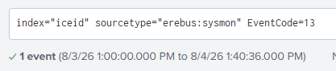

*I first searched registry telemetry, then redirected when the question and timeline pointed to scheduled-task creation.*

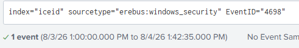

*Searched Security Event 4698 (A scheduled task was created) for task creation.*

### Evidence Examined

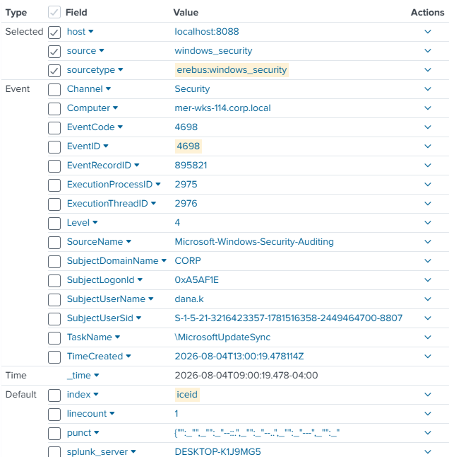

*This log involves the compromised identity seconds after the first stage payload was established, warranting further backward analysis of the timeline* 

**Notable Findings:**

- timestamp `09:00:19.478`
- user `CORP\dana.k`
- computer `mer-wks-114.corp.local`
- task `\MicrosoftUpdateSync`.

### Analysis

- **Observed Activity:** Security Event 4698 (A scheduled task was created) recorded creation of `\MicrosoftUpdateSync` by `dana.k` 27 seconds after the first-stage command.
- **Assessment — moderate confidence:** The task was malicious persistence based on timing, identity, and the surrounding confirmed compromise. The record shown did not expose the task action, trigger, or later execution, but there were also no further sources indicating `\MicrosoftUpdateSync`'s involvement.
- **Hypothesis — Posited:** The task was intended to re-establish or maintain the foothold if the active process chain ended.
- **Role of the Evidence:** Established a persistence artifact and answered the CTF task-name question, further enumerating the timeline and comprehensive attack chain.
- **Validation — Required:** Retrieve the task XML/action or find later execution under the task context. Additionally, if incident response actions conclude in eliminating the attacker in real-time, validate that the scheduled task is not still active. 

### Investigative Decision

- **Action — Pivot:** Search Sysmon Event 11 (File create) and related endpoint activity for files or later execution associated with the task, while keeping the task's intent as a hypothesis rather than a proven function.
- **Alternatives considered:** Continue registry searching for other persistence mechanisms--I decided not to because I had discovered registry activity earlier in my investigation, but it was much later in the incident; there were more important pivots to make at this time. 

### Lesson Learned

(1) Just because the attacker used one LotL or spoofing strategy doesn't meant they won't do it again. The majority of this attack chain is based in LotL strategies and LOLbins (such as the DLL compromise). The further I got into this investigation, the less I trusted basic presumptions of file paths, names, and process function. This added caution was ultimately what allowed completion of the investigation. 
(2) Coming from both incident response and forensic analysis training (Centri BTL1), I started the investigation requiring much more validation for pivots than I might have needed. I realized that not all investigations require forensic-level proof to move forward, and that incident response investigations often follow evidence even without 3-5 sources of validation. 

### Context Timeline

| Timestamp | Event | Key artifact | ATT&CK mapping | Relationship to current step |
| --- | --- | --- | --- | --- |
| 08:59:52 | First stage executed | `magni.waut.a` | T1105 Ingress Tool Transfer | Preceding event |
| 09:00:19 | Task created | `\MicrosoftUpdateSync` | T1053.005 Scheduled Task | Current evidence |
| 09:02:20 | DLL retrieved | `update.dll` | T1105 Ingress Tool Transfer | Subsequent activity |

## Step 9 — Attempting to Validate Persistence, Found Ransomware Sample 

### Intent

Find execution or file activity that would explain what the scheduled task entailed.

### Search Method

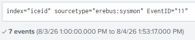

*Searched Sysmon Event 11 (File create), believing it would include files related to startup temp, or download directories following (informed by [ultimate IT Security](https://www.ultimatewindowssecurity.com/securitylog/encyclopedia/event.aspx?eventid=90011)) 
### Evidence Examined

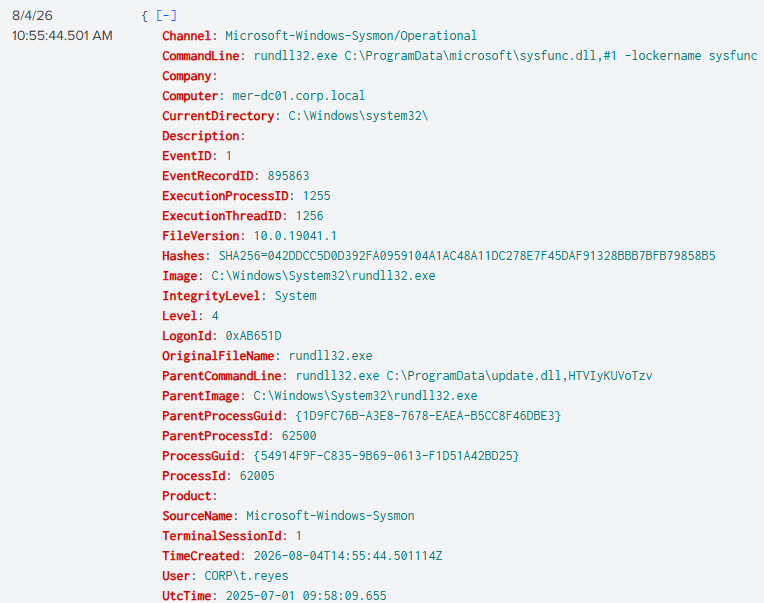

*The search did not validate the scheduled task; it exposed a sample of the incident's later encryption impact instead.*

**Notable Findings:**

- timestamp `10:55:44.501`
- host `mer-dc01.corp.local`
- user `CORP\t.reyes`
- `.dagoned` filenames
- nearby `sysfunc.dll` activity.

### Analysis

- **Observed Activity:** The Sysmon Event 11 (File create) result set contained files written with the `.dagoned` extension near the end of the scenario, matching descriptions of ransomware activity in the [DFIR](https://thedfirreport.com/2024/04/29/from-icedid-to-dagon-locker-ransomware-in-29-days/) .
- **Assessment — High confidence:** File encryption occurred on `MER-DC01`, and the extension was compatible with Dagon ransomware.
- **Hypothesis — Supported:** The broader incident matched an IcedID-to-Dagon ransomware chain, and the early payload activity ultimately led to ransomware impact. Given the name DC01, domain controller compromise was likely, although this required further evidence.
- **Role of the Evidence:** Revealed the incident endpoint, established a later boundary for timeline reconstruction, and gave OSINT hypotheses a locally observable impact artifact.
- **Validation — Required:** Identify the process and command immediately preceding `.dagoned` creation; continue investigating the intervening activity.

### Investigative Decision

- **Action — Pivot:** Return to the post-C2 timeline and follow attacker behavior toward discovery, credential access, lateral movement, and impact rather than forcing the Event 11 data into my current search.

### Lesson Learned

Just because I was successful in following the evidence much of the time does not mean I'll always find what I'm looking for--but it also doesn't mean I'm wasting my efforts if I don't. In this case, I made one of the most important discoveries in the timeline on accident by keeping my mind open to additional context. It's also important to note that my preference for full logs (instead of specified fields) is due to this methodology; if I can only see the field I'm interested in, I might miss out on the field that I need. 

### Context Timeline

| Timestamp | Event           | Key artifact           | ATT&CK mapping  | Relationship to current step |
| --------- | --------------- | ---------------------- | --------------- | ---------------------------- |
| 09:00:19  | Task created    | `\MicrosoftUpdateSync` | T1053.005 Scheduled Task       | Original validation target   |
| 10:55:44  | Locker executed | `sysfunc.dll`          | T1486 Data Encrypted for Impact — Posited | Immediate context            |
| 10:55:44  | Files renamed   | `.dagoned`             | T1486 Data Encrypted for Impact           | Current evidence             |

## Step 10 — Finding Cobalt Strike Context in Zeek

### Intent

Follow network-flow telemetry around the timeline to gain context on the C2 connection, hoping to enumerate AD reconnaissance (based on a CTF question).

### Search Method

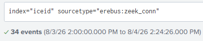

*Started broadly in `zeek_conn` and focused on activity after the 09:02 C2 window.*

### Evidence Examined

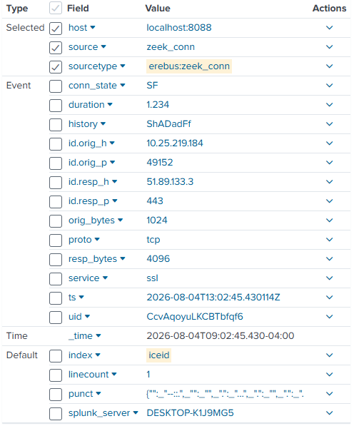

*I recognized similar information here as in the [Sysmon Event 3 (Network connection)](#step-3) discovered earlier, so I analyzed it* 

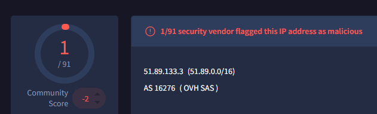

*Used reputation and OSINT references to test whether the address fit my developing hypothesis.*

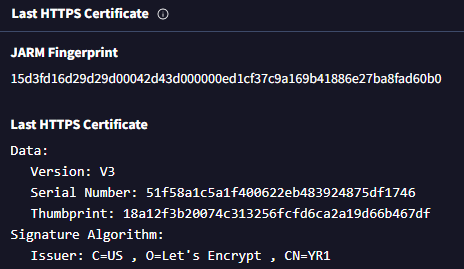

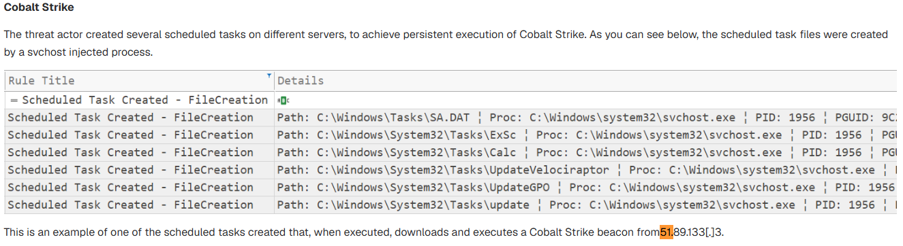

*The certificate was context warranting suspicion; the campaign report supplied the specific Cobalt Strike association.*

**Notable Findings:**

- source `10.25.219.184`
- destination `51[.]89[.]133[.]3`
- connection time matching the Sysmon C2 event.

### Analysis

- **Observed Activity:** Zeek recorded the same outbound connection independently of the endpoint event in Sysmon 3 (Network connection). Reputation and campaign research associated the destination with Cobalt Strike infrastructure in the referenced IcedID-to-Dagon case.
- **Assessment — med/high confidence:** The connection was malicious C2 activity. **Medium confidence** that the second-stage payload specifically operated as Cobalt Strike because the local evidence did not include a payload configuration or memory analysis.
- **Hypothesis — Supported:** `update.dll` provided a Cobalt Strike-compatible beacon used after IcedID-style initial execution.
- **Role of the Evidence:** Strengthened the C2 conclusion across endpoint, DNS, and network-flow telemetry while defining the limits of exact payload attribution. 
- **Validation — Optional:** Memory capture, beacon configuration extraction, or payload analysis could establish the framework more directly.

### Investigative Decision

- **Action — Pivot:** Search Zeek DNS for internal discovery or enumeration related to the compromised host. That pivot did not produce the expected evidence and continues in [Step 11](Appendix-Investigative-Pivots.md#step-11).
- **Alternatives considered:** Continue OSINT research; To this point, I had only read a parts of the referenced OSINT, stopping when I had enough context to form informed behavioral hypotheses.

### Lesson Learned

There are times to continue looking through local evidence and times where OSINT searches are more useful. I think over time, I'll get better at understanding the relative ROI of these decisions, but in this case, I found that a full analysis of what seems like a dead-end allowed further context of the payload (CobaltStrike references).

### Context Timeline

| Timestamp | Event           | Key artifact        | ATT&CK mapping                | Relationship to current step |
| --------- | --------------- | ------------------- | ----------------------------- | ---------------------------- |
| 09:02:20  | DLL retrieved   | `update.dll`        | T1105 Ingress Tool Transfer   | Payload context              |
| 09:02:45  | C2 connection   | `51[.]89[.]133[.]3` | T1071.001 Web Protocols       | Current corroboration        |
| ??:??:??  | DC01 enumerated | ???                 | T1018 Remote System Discovery | Desired Finding              |

## Step 13 — Examining LSASS Process Access

*See the appendix for [Step 11 — Zeek DNS Context](Appendix-Investigative-Pivots.md#step-11) and [Step 12 — PAN-OS Discovery Search](Appendix-Investigative-Pivots.md#step-12).*

### Intent

Search an unfamiliar but potentially useful endpoint source (Sysmon 10 (Process access)) for evidence of AD reconnaissance.

### Search Method

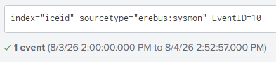

*Searched Sysmon Event 10 (Process access) globally and received one result.*

### Evidence Examined

*This event allowed me to learn more about Sysmon 10 (Process access) and seemed to fit the timeline.*

**Notable Findings:**

- timestamp `09:04:52.511`
- source `rundll32.exe`
- target `lsass.exe`
- user `CORP\dana.k`
- granted access `0x1010`.

### Analysis

- **Observed Activity:** The compromised `rundll32.exe` process accessed `lsass.exe` with `GrantedAccess=0x1010` while running as `dana.k`.
- **Assessment — Medium confidence:** The event was compatible with credential dumping because it granted process-query and virtual-memory-read capabilities. It did not prove that credentials were extracted, what credentials were extracted, or where to.
- **Hypothesis — Posited:** The attacker attempted to collect reusable credentials from LSASS before lateral movement. This would also mean the attacker required some form of elevated privileges to dump the LSASS, allowing further inference into either (1) the nature of the malicious `update.dll` payload or (2) the timeline of privilege escalation (between 09:02:47 and 09:04:52)
- **Role of the Evidence:** Added a credential-access branch to the investigation. This provided numerous potential pivots and redirects but did not answer the immediate AD-recon question.
- **Validation — Required:** Memory-analysis evidence, credential-dumping tool artifacts, and/or later authenticated use attributable to exposed credentials.

### Investigative Decision

- **Action — Pivot:** Save the LSASS event as a supporting credential-access finding and continue to Windows object-access logs for other evidence.

### Lesson Learned

In my original verbiage, I severely overstated the role of this log. There is no direct evidence within the log sources that this LSASS instance was a true credential dump or what its role was in the incident. This reinforced the lesson that not every step requires in-depth validation to pivot from during an investigation, but it may require in-depth validation to claim surefire conclusions. 

### Context Timeline

| Timestamp | Event                                          | Key artifact              | ATT&CK mapping      | Relationship to current step |
| --------- | ---------------------------------------------- | ------------------------- | ------------------- | ---------------------------- |
| 09:0?:??  | Internal Recon?                                | ???                       | T1069 Permission Groups Discovery               | Likely prior occurrence      |
| 09:04:52  | LSASS accessed                                 | `0x1010` (granted access) | T1003.001 LSASS Memory — Posited | Current evidence             |
| ??:??:??  | Credentials read, used, dumped, or exfiltrated | ???                       | ???                 | Desired finding              |

## Step 14 — Finding Access to `passwords.xlsx`

### Intent

Check WinEvent 4663 (object access) logs for activity that could explain credential access or internal discovery.

### Search Method

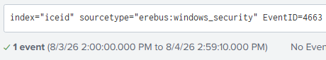

*Searched Event 4663 (An attempt was made to access an object) globally and reviewed the single result.*

### Evidence Examined

*This event appears to describe access to a network-shared password spreadsheet by a process on the compromised computer* 

**Notable Findings:**

- timestamp `09:05:14.405`
- user `dana.k`
- process `rundll32.exe`
- object `\\MER-FS01\Finance\passwords.xlsx`
- access mask `0x1`.

### Analysis

- **Observed Activity:** Event 4663 (An attempt was made to access an object) recorded `rundll32.exe` exercising access mask `0x1`—file read/data access—against `passwords.xlsx` on `MER-FS01`; basically, the compromised DLL accessed what appears to be a password file on the file system (FS01).
- **Assessment — High confidence:** The compromised DLL read a credential-themed network file, passwords.xlsx. The record did not reveal the file contents or what was obtained.
- **Hypothesis — Posited:** The file contained credentials later used for authenticated lateral movement, including the the MER-DC01/t.reyes identity associated with [later ransomware activity](#step-9).
- **Role of the Evidence:** Provided direct credential-file access and a possible explanation for later valid-account use, may be corroborated with [suspected lsass dump](#step-13) to explain later access (requires greater validation).
- **Validation — Required:** Seek evidence of authentication based in compromised identity surrounding dana.k to move investigation forward, for forensic validaton, access to the passwords.xlsx file in correlation with the investigation is required. 

### Investigative Decision

- **Action — Pivot:** Continue the planned Event 4688 (A new process has been created) search for AD-recon commands, then use subsequent logons and remote execution to test the credential-source hypothesis.
- **Alternatives considered:** Focus immediately on `MER-FS01` or the file's ACL, providing validation for what level of access the compromised user had and leading to how they obtained it. Unfortunately, this data was out of scope for the investigation.

### Lesson Learned

At the time, I was disappointed to have found another dead-end in my AD-discovery search, but I saved this finding on suspicion that it would prove useful later. This suspicion inadvertently lead to far greater organization of my investigation notes. In retrospect, this organization saved my investigation multiple times, proving to me that organization can make or break a project. 

### Context Timeline

| Timestamp | Event            | Key artifact     | ATT&CK mapping      | Relationship to current step |
| --------- | ---------------- | ---------------- | ------------------- | ---------------------------- |
| 09:04:52  | LSASS accessed   | `lsass.exe`      | T1003.001 LSASS Memory — Posited | Alternate credential source  |
| 09:05:14  | Shared file read | `passwords.xlsx` | T1552.001 Credentials In Files           | Current evidence             |
| ??:??:??  | Domain logon     | t.reyes`?        | T1078.002 Domain Accounts?          | Desired evidence             |

## Step 15 — Finding Active Directory Reconnaissance

### Intent

Continue exploring the context surrounding AD-recon (based on the CTF question regarding it). 

### Search Method

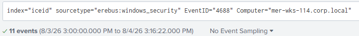

*Searched Event 4688 (A new process has been created) for compromised computer `mer-wks-114` and reviewed processes around 09:03–09:05.*

### Evidence Examined

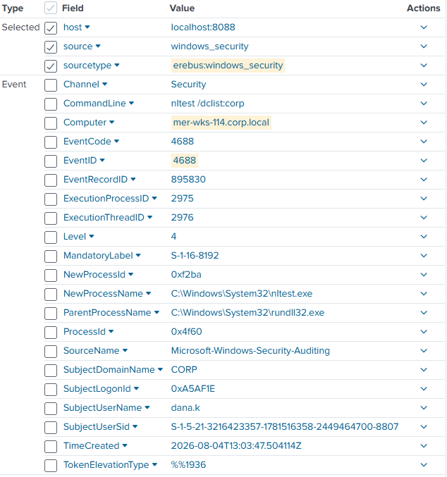

*This event answered the AD-recon question directly.*

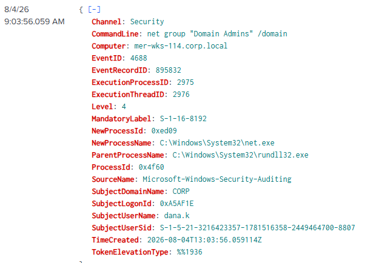

*A second event seconds later expanded the discovery behavior from controllers to privileged domain membership.*

**Notable Findings:**

- `nltest /dclist:corp`
- `net group "Domain Admins" /domain`
- parent `rundll32.exe`
- user `dana.k`.

### Analysis

- **Observed Activity:** The compromised `rundll32.exe` process launched `nltest.exe` to list domain controllers and `net.exe` to query the Domain Admins group.
- **Assessment — High confidence:** The attacker performed Active Directory reconnaissance with native Windows tools.
- **Hypothesis — Supported:** The attacker was shown enumerating privileged identities in the environment prior to activity of [suspected lsass dumping](#step-13) and the [successful access of a file which may contain passwords](#step-14); note that these events do not indicate proof of success in these actions, rather, they provide reasonable suspicion to inform further investigation when corroborated.
- **Role of the Evidence:** Answered the CTF reconnaissance question and supplied `MER-DC01`/privileged-account context moving forward.
- **Validation — N/A:** The commands directly expressed the discovery behavior.

### Investigative Decision

- **Action — Pivot:** Remain in Event 4688 (process creation) and move forward from 09:05, looking for remote-execution processes or DLL execution involving accounts not previously seen.

### Lesson Learned

Nearly everything has a process attached. I was looking at network sources, hoping to track attacker activity directly via communications, when in reality I should have looked for processes. A lot of times, I assume that every search will require a lot of searches to get to, as attackers may use botnets for concurrent attacks or stealth for evasion. I learned here that a simpler look into process creation may have greater ROI than a high-intensity enumeration of the full scenario. 

### Context Timeline

| Timestamp | Event | Key artifact | ATT&CK mapping | Relationship to current step |
| --- | --- | --- | --- | --- |
| 09:03:47 | DCs enumerated | `nltest /dclist:corp` | T1018 Remote System Discovery | Current evidence |
| 09:03:56 | Admin group queried | `net group` | T1069.002 Domain Groups | Current evidence |
| 09:04:52 | LSASS accessed | `0x1010` | T1003.001 LSASS Memory — Posited | Following activity |
| 09:05:14 | Password file read | `passwords.xlsx` | T1552.001 Credentials In Files | Following activity |

## Step 16 — Identifying WMI Lateral Movement

### Intent

Validate that the attacker truly had credentials by investigating post-reconnaissance activity around the compromised identity.

### Search Method

Continued reviewing Event 4688 (A new process has been created) after 09:05, prioritizing unfamiliar accounts, remote-management tools, and commands referencing domain systems.

### Evidence Examined

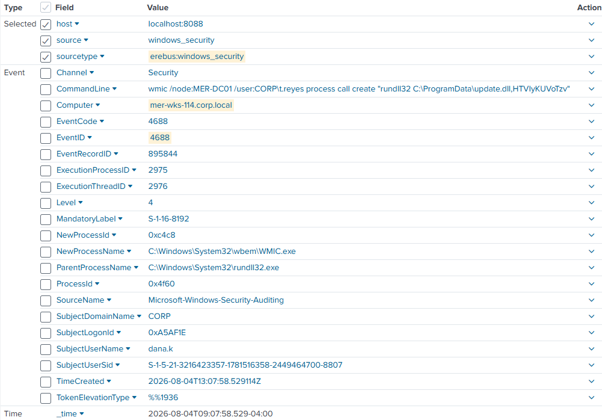

*This event shows a very suspicious chain-- `dana.k` launched WMIC against `MER-DC01` using `t.reyes` credentials and supplied a remote DLL-execution command.*

**Notable Findings:**

- timestamp `09:07:58.529`
- parent `rundll32.exe`
- child `WMIC.exe`
- node `MER-DC01`
- user argument `CORP\t.reyes`.

### Analysis

- **Observed Activity:** On compromised computer `mer-wks-114`, `rundll32.exe` launched WMIC with `/node:MER-DC01 /user:CORP\t.reyes process call create`, requesting remote execution of `rundll32 C:\ProgramData\update.dll,HTVIyKUVoTzv`.
- **Assessment — high confidence:** The attacker attempted authenticated WMI remote execution against the domain controller. The source event alone did not prove that the target created the process, but it did prove the attacker had enough privileged access to launch the remote command.
- **Hypothesis — Supported:** Credentials obtained during the prior credential-access phase enabled the attacker to use `t.reyes` for lateral movement. Further investigation required to confirm the success of the action.
- **Role of the Evidence:** Displays that the attacker has privileged access and the power to remotely execute code, which, given the role [update.dll](#step-6), lends the finding to suspicions of compromise on MER-DC01 via DLL injection (the same as [dana.k, the initial compromised host](#step-2)). 
- **Validation — Required:** Find destination-side process creation on `MER-DC01` and correlate the process identifiers.

### Investigative Decision

- **Action — Pivot:** Search Sysmon Event 1 (process create) on `MER-DC01` immediately after 09:07:58 for `WMIC.exe`, `rundll32.exe`, and/or `update.dll`.
- **Alternatives considered:** Validate the `t.reyes` logon first. I began with destination execution because it was the quickest way to determine whether the command was processed.

### Context Timeline

| Timestamp | Event                 | Key artifact     | ATT&CK mapping    | Relationship to current step |
| --------- | --------------------- | ---------------- | ----------------- | ---------------------------- |
| 09:05:14  | Password file read    | `passwords.xlsx` | T1552.001 Credentials In Files         | Credential context           |
| 09:07:45  | Domain logon          | `t.reyes`        | T1078.002 Domain Accounts         | Preceding authentication     |
| 09:07:58  | WMIC command launched | `MER-DC01`       | T1047 Windows Management Instrumentation             | Current evidence             |
| ??:??:??  | Remote DLL launched   | `update.dll`     | T1047 Windows Management Instrumentation / T1218.011 Rundll32 | Validation target            |

## Step 17 — Validating Destination-Side Execution

### Intent

Confirm that `MER-DC01` created the process requested by compromised computer's WMIC command.

### Search Method

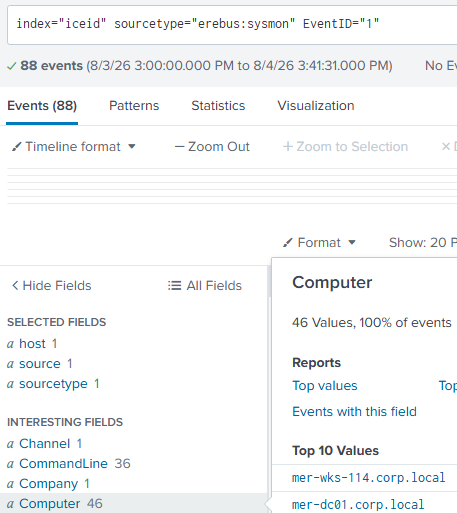

*Filtered Sysmon by computer and reviewed the first process event after the WMIC request.*

### Evidence Examined

*This log shows the same source command on MER-DC01/t.reyes*  

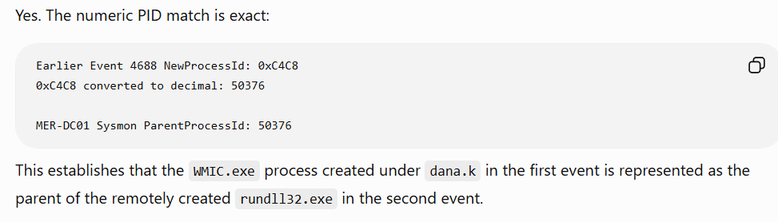

*Used AI to check the numeric conversion, then validated the result against the raw fields.*

**Notable Findings:**

- timestamp `09:08:06.701`
- computer `mer-dc01.corp.local`
- user `CORP\t.reyes`
- parent `WMIC.exe`
- command `rundll32.exe C:\ProgramData\update.dll,HTVIyKUVoTzv`.

### Analysis

- **Observed Activity:** `MER-DC01` created `rundll32.exe` beneath `WMIC.exe` with the same DLL and export requested from the source host.
- **Assessment — High confidence:** The WMI remote process-creation request succeeded at the launching the process on DC01. Source Event 4688 (A new process has been created) `NewProcessId=0xC4C8` converts to decimal `50376`, matching destination `ParentProcessId=50376` (validated with AI).
- **Hypothesis — Supported:** The attacker used `t.reyes` and WMI to execute the beacon DLL on the domain controller. Further evidence required to confirm full compromise, but this would allow validation for a [ransomware attack chain's](#step-9) possibility. 
- **Role of the Evidence:** Displays lateral movement after an attack chain indicating access to privileged credentials. Additionally, further validates that acquired credentials are valid for access to an account known to be a part of ransomware encryption later, allowing further pivots to prove Domain Controller compromise. 
- **Validation — Optional:** Authentication logs could explain the logon session and source address; payload analysis could establish what the DLL did after launch.

### Investigative Decision

- **Action — Pivot:** Validate the `t.reyes` authentication immediately before execution using PAN-OS (perimeter firewall) and Windows Security logs. This would connect the valid account and original workstation to the WMI event.

### Lesson Learned

While I always go for memorable fields such as "dana.k" over ones such as "0xC4C8" to fuel my investigations, this instance proved that AI-inclusion allows these obfuscated fields to be used in near real-time. As such, I learned that some of these codes provide necessary information and are worth an extra few seconds in an LLM. 

### Context Timeline

| Timestamp | Event               | Key artifact | ATT&CK mapping    | Relationship to current step |
| --------- | ------------------- | ------------ | ----------------- | ---------------------------- |
| 09:0?:??  | logon?              | `t.reyes`    | T1078.002 Domain Accounts         | Suspected preceding support  |
| 09:07:58  | WMIC request        | PID `0xC4C8` | T1047 Windows Management Instrumentation             | Source evidence              |
| 09:08:06  | DLL process created | PPID `50376` | T1047 Windows Management Instrumentation / T1218.011 Rundll32 | Current evidence             |

## Step 18 — Validating the Domain-Controller Authentication

### Intent

Validate authentication of t.reyes/MER-DC01 prior to [WMI event](#step-16).

### Search Method

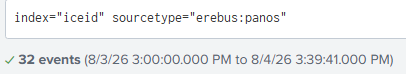

*Reviewed PAN-OS authentication events, then searched `MER-DC01` broadly for a Windows logon record in the same second.*

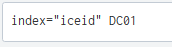

*Used the firewall time as the target for endpoint validation.*

### Evidence Examined

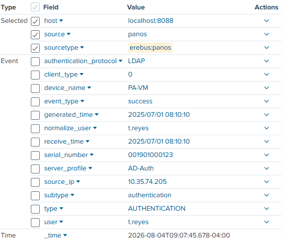

*The perimeter record identified a successful `t.reyes` authentication near the WMI event.*

*This successful login log details t.reyes and 10.25.219.183--dana.k's IP address* 

**Notable Findings:**

- timestamp `09:07:45.678`
- target `CORP\t.reyes`
- source IP `10.25.219.184`
- `NTLM`
- Logon Type `3`
- ElevatedToken `%%1842`.

### Analysis

- **Observed Activity:** Windows recorded a successful NTLM network logon for `t.reyes` on `MER-DC01` from `10.25.219.184` (dana.k's IP), with an elevated token. PAN-OS recorded a successful authentication in the same second.
- **Assessment — High confidence:** A privileged network logon using `t.reyes` preceded the WMIC command from the compromised workstation.
- **Hypothesis — Supported:** The attacker obtained or possessed valid `t.reyes` credentials after the observed credential-access activity and used them for WMI lateral movement.
- **Role of the Evidence:** This findings supports the claim that enumeration of Domain Controllers and credential-access were successful. As such, it connects valid-account use, source workstation, domain controller, and elevated remote execution. 
- **Validation — Optional:** Domain-controller authentication logs, credential-source evidence, or memory forensics could determine exactly how the credential was obtained and presented.

### Investigative Decision

- **Action — Pivot:** Move forward from confirmed DC execution and use the next CTF persistence question to search for remote-access software and related registry changes.

### Lesson Learned

I initially believed that NTLM meant a user typed a password, since my logins are NTLM. Upon further research, I realized that the log supports valid credential use, but does not specify the kind of credential. Still, since the passwords.xlsx file was found after the suspected lsass dump, I had assumed the attacker had plain-text passwords. Early versions of this project posit as much, but during my last proofread, I edited the verbiage significantly to reflect better founded claims, communication, and documentation. I learned here that humility and open-mindedness are some of the best skills to have as a communicator, even in a report. 

### Context Timeline

| Timestamp | Event | Key artifact | ATT&CK mapping | Relationship to current step |
| --- | --- | --- | --- | --- |
| 09:05:14 | Credential file read | `passwords.xlsx` | T1552.001 Credentials In Files | Possible credential source |
| 09:07:45 | NTLM logon | `t.reyes`, `10.25.219.184` | T1078.002 Domain Accounts | Current evidence |
| 09:07:58 | WMIC request | `MER-DC01` | T1047 Windows Management Instrumentation | Immediate follow-on |
| 09:08:06 | Remote DLL launched | `update.dll` | T1218.011 Rundll32 | Validated outcome |

## Step 19 — Finding Hidden-Account Registry Activity

### Intent

Discover evidence of a persistence via registry edits, specifically aimed at the tool used for persistence.

### Search Method

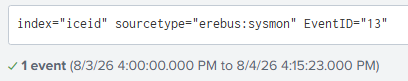

*Searched Sysmon Event 13 (Registry value set) and reviewed changes post DC compromise (09:08).*

### Evidence Examined

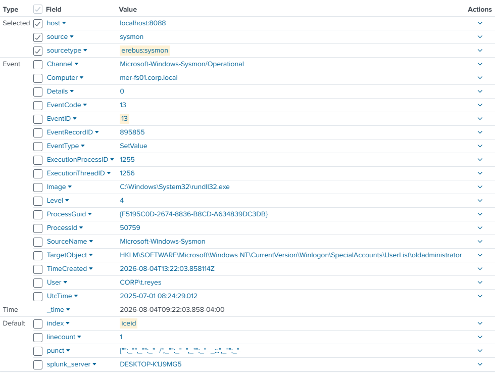

*This log details `t.reyes`  and `rundll32.exe` post DC compromise, where a Winlogon path was modified via MER-FS01.*

**Notable Findings:**

- timestamp `09:22:03.858`
- computer `mer-fs01.corp.local`
- user `CORP\t.reyes`
- target ending `SpecialAccounts\UserList\oldadministrator`
- event type `SetValue`.

### Analysis

- **Observed Activity:** `rundll32.exe`, under user `t.reyes`, set a registry value for `oldadministrator` under Winlogon's `SpecialAccounts\UserList` on Computer `MER-FS01`.
- **Assessment — High confidence:** The change was intended to conceal the named account from the normal Windows logon interface. The event did not by itself prove when the account was created, whether the operation originated remotely, or what groups the account belonged to.
- **Hypothesis — Posited:** `oldadministrator` was an attacker-created persistence account associated with the remote-access activity on `MER-FS01`, noting that FS typically stands for "fileserver", allowing further hypotheses to be considered on the nature of these implications. 
- **Role of the Evidence:** Supplied an account name, host, and upper time boundary for the persistence investigation.
- **Validation — Required:** Find earlier process creation for a remote-access tool and Event 4720 (A user account was created) for account creation.

### Investigative Decision

- **Action — Pivot:** Search Event 4688 (process creation) for `t.reyes` between the 09:08 domain-controller execution and the 09:22 registry change, looking for a remote-access tool or account-management process.

### Context Timeline

| Timestamp | Event                      | Key artifact        | ATT&CK mapping | Relationship to current step           |
| --------- | -------------------------- | ------------------- | -------------- | -------------------------------------- |
| 09:08:06  | DC payload launched        | `update.dll`        | T1047 Windows Management Instrumentation          | Prior compromise                       |
| 09:??:??  | Remote Management Tool Use | ???                 | T1219 Remote Access Software          | Suspected persistence activity         |
| 09:????   | Account created            | `oldadministrator`  | T1136.001 Local Account      | Suspected attacker account in question |
| 09:22:03  | Account hidden             | Winlogon `UserList` | T1112 Modify Registry          | Current evidence                       |

## Step 20 — Identifying AnyDesk Execution

### Intent

Find the remote-access tool between [DC compromise](#step-18) (09:08) and [registry edit](#step-19) (09:22).

### Search Method

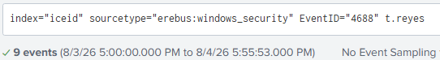

*Searched Event 4688 (A new process has been created) for `t.reyes` during the gap before the registry change.*

### Evidence Examined

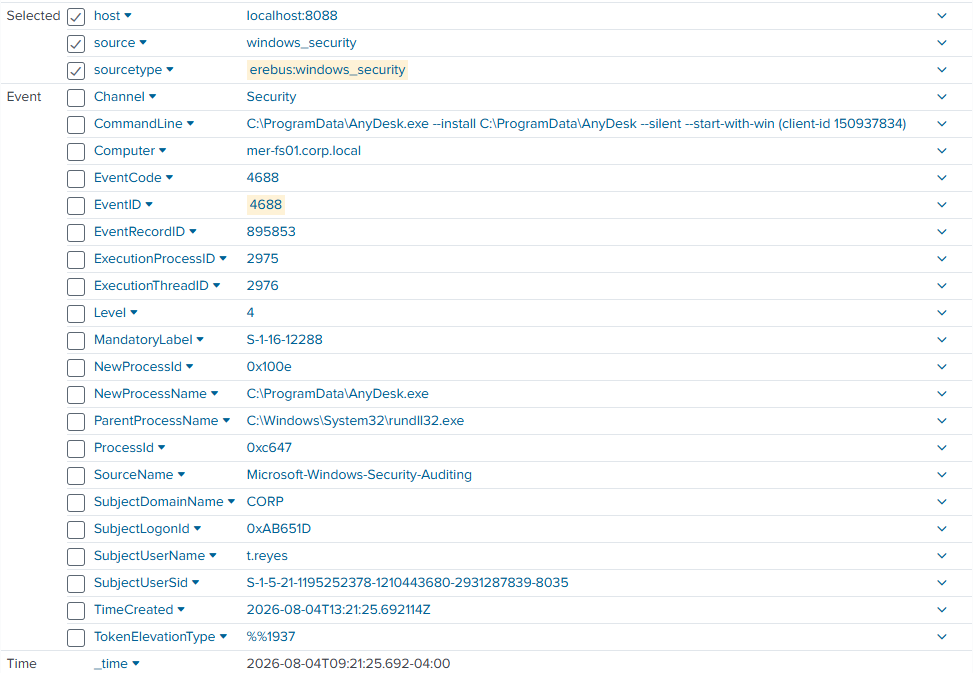

*This log indicates use of AnyDesk.exe running from ProgramData on MER-FS01 within the timeline gap desired*

**Notable Findings:**

- timestamp `09:21:25.592`
- computer `mer-fs01.corp.local`
- user `t.reyes`
- process `C:\ProgramData\AnyDesk.exe`
- parent `rundll32.exe`.

### Analysis

- **Observed Activity:** `t.reyes` launched `AnyDesk.exe` from `C:\ProgramData` on `MER-FS01` beneath `rundll32.exe` with an elevated token.
- **Assessment — High confidence:** AnyDesk execution was malicious remote-access activity in this incident context. This is one of the few instances where the CTF validates the findings, where explicit logs detailing installation, execution, and created session were not found in the log set. 
- **Hypothesis — Supported:** The attacker deployed AnyDesk for continued remote access after lateral movement.
- **Role of the Evidence:** Answered the CTF remote-access-tool question and narrowed account creation to the next minute.
- **Validation — Optional:** AnyDesk service, configuration, connection, or network telemetry could establish installation and session details.

### Investigative Decision

- **Action — Pivot:** Search Event 4720 (A user account was created) around 09:21–09:22 for creation of `oldadministrator`, then correlate it with the [registry](#step-19) event.

### Context Timeline

| Timestamp | Event               | Key artifact        | ATT&CK mapping | Relationship to current step |
| --------- | ------------------- | ------------------- | -------------- | ---------------------------- |
| 09:08:06  | DC payload launched | `t.reyes`           | T1047 Windows Management Instrumentation          | Prior account compromise     |
| 09:21:25  | AnyDesk executed    | `AnyDesk.exe`       | T1219 Remote Access Software          | Current evidence             |
| 09:2?:??  | Account created     | `oldadministrator`  | T1136.001 Local Account      | Next validation              |
| 09:22:03  | Account hidden      | Winlogon `UserList` | T1112 Modify Registry          | Supporting context           |

## Step 21 — Confirming Local Account Creation

### Intent

Enumerate creation details surrounding `oldadministrator` 

### Search Method

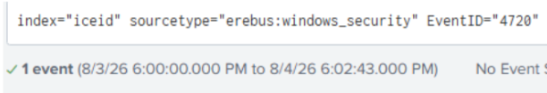

*Searched Windows Security Event 4720 (A user account was created) and received one account-creation record.*

### Evidence Examined

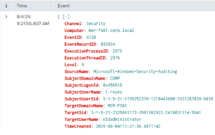

*This log explicitly details the creation of oldadministrator under the identity t.reyes on MER-FS01*

**Notable Findings:**

- timestamp `09:21:56.807`
- subject `CORP\t.reyes`
- target `oldadministrator`
- target domain `MER-FS01`
- target SID ending `-5541`.

### Analysis

- **Observed Activity:** Event 4720 (A user account was created) recorded `t.reyes` creating the local account `oldadministrator` on `MER-FS01`. 
- **Assessment — med/high confidence:** The account was likely attacker-created persistence based on the surrounding AnyDesk and concealment events. While the account is called "oldadministrator", there is no present indication via SID or activity that the account is an administrator under any domain. 
- **Hypothesis — Supported:** It is likely that the attacker created and hid `oldadministrator` to preserve access to `MER-FS01`, although further validation would be required to prove this.
- **Role of the Evidence:** Confirmed account creation and completed the three-event persistence sequence.
- **Validation — Required:** Further connections via AnyDesk or use during the attack chain could validate its purposes. WinEvent 4732 (account added to security-enabled local group), local group inventory, or endpoint state would be needed to prove local administrator membership.

### Investigative Decision

- **Action — Redirect:** Return to the CTF question sequence to continue building the timeline forward. The next question's wording caused several exploratory pivots, documented beginning with [Step 22](Appendix-Investigative-Pivots.md#step-22).
- **Alternatives considered:** Search Event 4732 (A member was added to a security-enabled local group) immediately for Administrators-group membership. I recorded the option but prioritized timeline completion; the missing validation was attempted but undocumented due to 0 findings of 4732 or further events regarding the `oldadministrator` account. 

### Lesson Learned

When I validated the existence of this account was attacker-created, I asked myself, "why would an attacker with DC access create a persistence account without privileged access?" 

At the time, I assumed the account as a local administrator. This lead to a vast overstatements across the project, lowering my credibility as an investigator. I then fact-checked every available source, including SIDs, and found that there was no hard evidence for my claim. 

Through this process, I learned that it's alright to form hypotheses for the investigation's sake, but that claims require more than just "likelihood" for proper validation. 

### Context Timeline

| Timestamp | Event                        | Key artifact        | ATT&CK mapping | Relationship to current step |
| --------- | ---------------------------- | ------------------- | -------------- | ---------------------------- |
| 09:21:25  | AnyDesk executed             | `AnyDesk.exe`       | T1219 Remote Access Software          | Preceding event              |
| 09:21:56  | Account created              | SID ending `-5541`  | T1136.001 Local Account      | Current evidence             |
| 09:22:03  | Registry Edit/Account hidden | Winlogon `UserList` | T1112 Modify Registry          | Following support            |

## Step 24 — Identifying the rclone Exfiltration Command

*See the appendix for [Step 22 — The Rosa False Lead](Appendix-Investigative-Pivots.md#step-22) and [Step 23 — Treating Outlook as a Fileshare Lead](Appendix-Investigative-Pivots.md#step-23).*

### Intent

Backtrack from ransomware impact to find data movement or exfiltration activity in the unresolved timeline, hopefully providing clues as to what the network-share credential-harvester was (CTF question).

### Search Method

Continued reviewing Event 4688 (process creation) after the persistence sequence, looking for unusual tools and command lines before encryption.

### Evidence Examined

*This log details exfiltration activity using rclone and an AWS S3 cloud bucket*

**Notable Findings:**

- timestamp `10:24:05.730`
- process `C:\ProgramData\rclone.exe`
- source `C:\ProgramData\microsoft`
- destination `remote:mer-backup-9f2`
- `--transfers 8`
- `--s3-provider AWS`.

### Analysis

- **Observed Activity:** `t.reyes` launched an elevated rclone command on `MER-FS01` instructing the tool to copy a local directory recursively to a configured remote using the AWS S3 provider and eight concurrent transfers.
- **Assessment — High confidence:** The command expressed cloud-exfiltration intent in the ransomware timeline. Further findings did not report completion, bytes transferred, or cloud-side object creation.
- **Hypothesis — Supported:** The attacker staged data under `C:\ProgramData\microsoft` and attempted or performed exfiltration to Amazon S3 before encryption. Given their completion of the Dagon ransomware sequence thereafter, there is likelihood of success, but not confirmation.
- **Role of the Evidence:** Identified the exfiltration tool, local source, remote backend/path, cloud provider, and order of operations.
- **Validation — Required:** The attacker's AWS S3 audit logs, network-volume telemetry, rclone output, or destination object records would prove completion and scope. Additionally, the role of FS01 in the organization could help form stronger hypotheses and/or understand attacker motives, goals, and identity. 

### Investigative Decision

- **Action — Redirect:** Continue searching for the network-share credential-harvesting answer while retaining rclone as a major exfiltration finding. My next Slack-related lead was weak and is documented in [Step 25](Appendix-Investigative-Pivots.md#step-25).
- **Alternatives considered:** Search other rclone events, AWS/S3 references, and the staging directory. I later returned to rclone research in [Step 30](Appendix-Investigative-Pivots.md#step-30).

### Lesson Learned

Backward analysis from the ransomware's completion repeatedly exposed stronger signals than my forward search. This was another moment where my 1st drafted report contained vast overstatements of claims, and in the process of editing I realized that *a process command may establish intent without proving outcome.* 

### Context Timeline

| Timestamp | Event               | Key artifact       | ATT&CK mapping | Relationship to current step |
| --------- | ------------------- | ------------------ | -------------- | ---------------------------- |
| 09:22:03  | Account hidden      | `oldadministrator` | T1112 Modify Registry          | Earlier persistence          |
| 10:24:05  | Cloud copy launched | `rclone.exe`       | T1567.002 Exfiltration to Cloud Storage      | Current evidence             |
| 10:55:44  | Encryption begins   | `.dagoned`         | T1486 Data Encrypted for Impact          | Later impact                 |

## Step 26 — Finding Recovery-Inhibition Activity

*See the appendix for [Step 25 — Testing the Slack Lead](Appendix-Investigative-Pivots.md#step-25).*

### Intent

Understand what activity occurred between exfiltration and encryption while checking endpoint behavior for the network-share credential-harvester (CTF question).

### Search Method

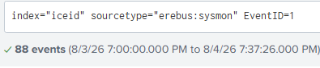

*Returned to Sysmon Event 1 (Process creation) and reviewed unfamiliar processes later in the incident window.*

### Evidence Examined

*This log fits the desired timeframe and fits the window that recovery-inhibition activities would likely occur; I analyzed it to get more familiar with vssadmin*

**Notable Findings:**

- timestamp `10:54:12.020`
- computer `mer-dc01.corp.local`
- user `CORP\t.reyes`
- parent `rundll32.exe`
- command `vssadmin delete shadows /all /quiet`
- integrity `System`.

### Analysis

- **Observed Activity:** On `MER-DC01`, the malicious `rundll32.exe` chain launched `vssadmin.exe` with arguments to delete all accessible shadow copies without prompts.
- **Assessment — High confidence:** This was attempted recovery inhibition immediately before ransomware execution. 
- **Hypothesis — Supported:** The attacker attempted to reduce local recovery options after exfiltration and before file encryption. A weaker hypothesis based on the data staging pathway C:\Program\microsoft could assume this included the organization's filesystem if FS01 is the filesystem; requires far greater validation, but and important consideration based on blast-radius. 
- **Role of the Evidence:** Filled a major pre-impact timeline gap and supported the Dagon ransomware/double-extortion model.
- **Validation — Required:** Command output, VSS operational logs, `vssadmin list shadows`, or host-state evidence would establish completion and scope.

### Investigative Decision

- **Action — Research:** Pause the weak fileshare pivots and use the DFIR report plus technical references to understand the observed recovery-inhibition behavior. The resulting OSINT and proxy branches appear in [Steps 27–30](Appendix-Investigative-Pivots.md#step-27), with exception to one valuable source used to form the above "role of evidence" belief from [Sentinel One](https://www.sentinelone.com/anthology/dagon-locker/).

### Lesson Learned

At this point in the investigation, I not only have the logs to indicate a lot of highly destructive behavior, but the OSINT to form hypotheses on further damages. Because of this, I on the edge of over-confidence for all of my claims. Upon retrospect, I found that my verbiage reflected this and spent a while mulling over the evidence and admitting (1) what actually happened versus (2) what could have happened. "Could" is the keyword, and when making claims, "could" is not validation. This taught me a valuable lesson in framing evidence and marking prose. 

### Context Timeline

| Timestamp | Event                     | Key artifact           | ATT&CK mapping | Relationship to current step  |
| --------- | ------------------------- | ---------------------- | -------------- | ----------------------------- |
| 10:24:05  | Cloud copy launched       | `rclone.exe`           | T1567.002 Exfiltration to Cloud Storage      | Earlier exfiltration activity |
| 10:54:12  | Shadows deletion launched | `vssadmin /all /quiet` | T1490 Inhibit System Recovery          | Current evidence              |
| 10:55:44  | Encryption begins         | `.dagoned`             | T1486 Data Encrypted for Impact          | Following Impact              |

## Step 31 — Validating VSS Context and Log Clearing

*See the appendix for [Step 27 — OSINT-Fueled Redirection](Appendix-Investigative-Pivots.md#step-27), [Step 28 — Rechecking the Proxy](Appendix-Investigative-Pivots.md#step-28), [Step 29 — Returning to the Shared File](Appendix-Investigative-Pivots.md#step-29), and [Step 30 — Researching rclone](Appendix-Investigative-Pivots.md#step-30).*

### Intent

Validate the meaning of the VSSAdmin command and determine what the next event established.

### Search Method

Reviewed the earlier VSSAdmin event against technical references, then searched for Windows Security Event 1102 (The audit log was cleared) near the ransomware window.

### Evidence Examined

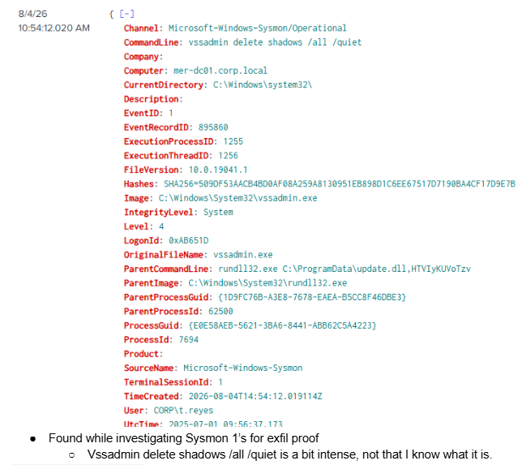

 *Revisited VSSAdmin for further understanding of the scenario after OSINT reflection*

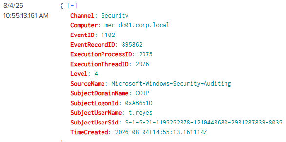

*This event fit between VSSAdmin and \dagoned, but I was not familiar with 1102 (The audit log was cleared) at the time so I analyzed it*

**Notable Findings:**

- Event ID `1102` (The audit log was cleared)
- timestamp `10:55:13`
- computer `mer-dc01.corp.local`
- subject `t.reyes`.

### Analysis

- **Observed Activity:** The earlier Sysmon event recorded the VSS deletion command launching. Event 1102 (The audit log was cleared) then recorded clearing of the Windows Security audit log on `MER-DC01`.
- **Assessment — High confidence:** The attacker attempted recovery inhibition and cleared the Security log before ransomware execution. While this does not validate VSSAdmin success, it does validate defense evasion and Dagon ransomware attack chain.
- **Hypothesis — Supported:** The attacker prepared for ransomware impact by reducing recovery options and removing local audit evidence.
- **Role of the Evidence:** Corrected an original overstatement and added a distinct defense-evasion event to the final attack sequence.
- **Validation — Required:** VSS status or operational logs for deletion outcome; no further validation was required to conclude that the Security log was cleared.

### Investigative Decision

- **Action — Redirect:** Return to the unresolved fileshare question, reconsider its wording, and then finish the CTF's impact questions. The reinterpretation and coverage check are documented in [Steps 32–33](Appendix-Investigative-Pivots.md#step-32).

### Lesson Learned

I'd initially posited that 1102 (The audit log was cleared) meant and audit success, as in "a monitored security action or event was completed successfully". Within the same breath, I read it a bit closer and realized it was defense evasion, but this did teach me something valuable about my conclusions--I like to view chronology as evidence. While chronology may often lead to evidence, various points in a chronology must be treated as "needs validated", "is validated," or "is validation". Modern techniques often include high degrees of stealth, evasion, obfuscation, and redirection. This is where I got the inspiration for my "validation" field in each step entry of this investigation. 

### Context Timeline

| Timestamp | Event                     | Key artifact   | ATT&CK mapping | Relationship to current step |
| --------- | ------------------------- | -------------- | -------------- | ---------------------------- |
| 10:24:05  | Cloud copy launched       | `rclone.exe`   | T1567.002 Exfiltration to Cloud Storage      | Earlier action               |
| 10:54:12  | Shadows deletion launched | `vssadmin.exe` | T1490 Inhibit System Recovery          | Related evidence             |
| 10:55:13  | Security log cleared      | Event 1102 (The audit log was cleared)     | T1070.001 Clear Windows Event Logs      | Current evidence             |
| 10:55:44  | Encryption begins         | `.dagoned`     | T1486 Data Encrypted for Impact          | Following Impact             |

## Step 34 — Identifying the Ransomware Payload

*See the appendix for [Step 32 — Reinterpreting the Fileshare Question](Appendix-Investigative-Pivots.md#step-32) and [Step 33 — Performing the Final Coverage Check](Appendix-Investigative-Pivots.md#step-33).*

### Intent

Identify the on-disk DLL executed immediately before the `.dagoned` files appeared (CTF question).

### Search Method

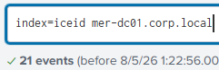

*Searched `MER-DC01` after Event 1102 (The audit log was cleared) and reviewed the final process before the file-creation impact.*

### Evidence Examined

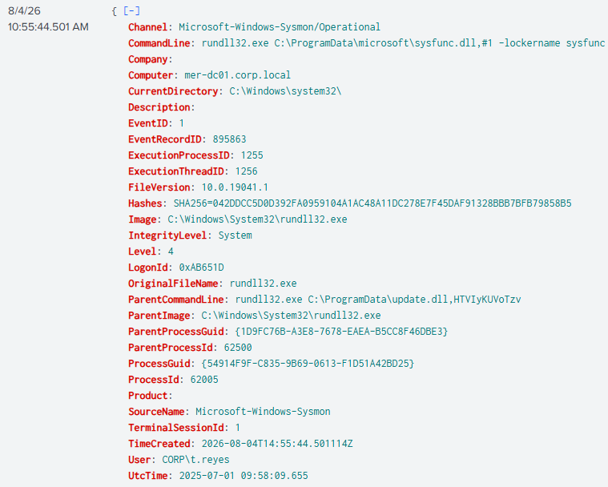

*Chose this event because it launched the DLL immediately before the first observed `.dagoned` file creation.*

**Notable Findings:**

- timestamp `10:55:44.501`
- command `rundll32.exe C:\ProgramData\microsoft\sysfunc.dll,#1 -lockername sysfunc`
- parent `update.dll`
- user `CORP\t.reyes`
- computer `mer-dc01.corp.local`.

### Analysis

- **Observed Activity:** `rundll32.exe` loaded `sysfunc.dll`, selected export ordinal `#1`, and passed `-lockername sysfunc`. The process immediately preceded `.dagoned` file creation.
- **Assessment — High confidence:** `sysfunc.dll` was the on-disk encryption payload and this log affirms that the incident reached ransomware impact. `sysfunc` was the deployment or locker label in the command; its context, my OSINT research, and the \dagoned nomenclature support its ransomware family placement.
- **Hypothesis — Supported:** The IcedID-style initial chain progressed through C2, credential access, WMI lateral movement, exfiltration, and recovery inhibition before Dagon ransomware encryption.
- **Role of the Evidence:** Completed the impact reconstruction and answered the remaining payload, ATT&CK, attack-class, and ransomware-family questions.
- **Validation — Optional:** Static/dynamic analysis of `sysfunc.dll`, its hash, and file-write behavior would provide malware-level confirmation beyond the CTF ground truth and observed extension.

### Investigative Decision

- **Action — End Investigation:** The evidence answered the CTF questions and supported an operational incident report. Remaining gaps were documented as limitations and collection requests rather than expanded into unsupported conclusions.

### Lesson Learned

The command syntax matters: `rundll32.exe` loaded a DLL export by ordinal, while `-lockername sysfunc` belonged to the invoked code. Calling the activity “DLL injection” would have described a different technique than the evidence showed.

### Context Timeline

| Timestamp | Event | Key artifact | ATT&CK mapping | Relationship to current step |
| --- | --- | --- | --- | --- |
| 10:54:12 | Recovery inhibited | `vssadmin.exe` | T1490 Inhibit System Recovery | Pre-impact action |
| 10:55:13 | Audit log cleared | Event 1102 (The audit log was cleared) | T1070.001 Clear Windows Event Logs | Immediate predecessor |
| 10:55:44 | Locker launched | `sysfunc.dll,#1` | T1218.011 Rundll32 / T1486 Data Encrypted for Impact | Current evidence |
| 10:55:44 | Files encrypted | `.dagoned` | T1486 Data Encrypted for Impact | Impact validation |

## Conclusion

When I committed time to this CTF, I planned to answer the questions. Upon receiving the log set, I decided to run an investigation. In doing so, I learned/reinforced lessons on every level from what 0x1010 means to what verbiage to choose for an incident report on an incomplete dataset.  

The investigation itself was non-linear and showcases an incident with a potentially vast blast-radius. A single phishing event turned into DC compromise and showed signs of filesystem exfiltration and full-scale ransomware, although these are mainly hypotheses, as the dataset was incomplete. Hopefully by witnessing how an investigator pivots, it is realized that linear investigations may not always warrant the highest ROI. In my case, this investigation proved that retrospective analysis often provides louder, clearer signals from which to back-pivot from. This allowed more informed searched for OSINT, which snowballed into the quick-paced investigation pivots I enacted throughout. 

Despite the overall success of this project, there is a large gap in the timeline. At this point, I would like to acknowledge this as a potential point to strengthen and describe my reasoning for this gap. 

Much of the investigation from 9:25 to 10:25 remains likelihoods, which, though I found weak evidence for, did not warrant explicit discourse in the format above. The only evidence of this period was a series of malicious DLL commands similar to the WMI remote-access that led to DC compromise, but instead of DC compromise, it was user accounts across the domain. Unfortunately, there was no evidence of subsequent exfiltration or success of these DLL injections, so it was left out of the investigation steps above. 

To summate the "lesson learned" category found across this document, I have made a succinct list. This list, by no regards indicate the full scope of what was learned. For a fuller picture, continue on to the [Appendix](Appendix-Investigative-Pivots.md), where most of my mishaps are documented and learned from. 

The main lessons were practical:

- State what a log proves before explaining what it might mean.
- Use confidence language when a conclusion depends on context or missing sources.
- Treat process creation and command outcome as different questions.
- Let strong artifacts redirect the investigation, even when they do not satisfy the original search intent (unless there is a critical situation in your environment!).
- Use OSINT and AI to accelerate understanding, then return to the local evidence; do your own work first!
- Preserve dead ends when they expose a reusable method, limitation, or correction. There's always time to learn and improve, even if it's after the incident. 

For a less personal conclusion to this investigation, see the [Incident Report](Incident-Report.md). 
